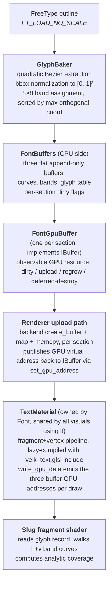

# Text plugin

The text plugin (`velk_text`) brings font loading and text rendering support into velk-ui. Loaded automatically by the runtime — no manual setup needed.

## Approach

The text plugin (`velk_text`) renders text using **analytic Bezier glyph coverage**, adapted from Eric Lengyel's public-domain [Slug](https://github.com/EricLengyel/Slug) reference shaders (see `/velk-ui/plugins/text/src/embedded/velk_text_glsl.h` for the GLSL source). 

Instead of a traditional glyph atlas, glyphs are extracted once with FreeType, packed into GPU-resident curve and band buffers, and shaded per-pixel by a fragment shader that computes exact analytic coverage of every Bezier inside the sample's footprint. 

The same font instance can render at any pixel size without re-baking, with sub-pixel anti-aliasing computed from the curve geometry directly, as shown in the following screen capture:


The trade-off is shader cost: every text pixel runs an inside-test that walks a small list of Bezier curves and computes a polynomial root. The band acceleration structure keeps that list short (typically 6 to 16 curves per pixel for typical Latin glyphs), so cost stays bounded and predictable for UI text quantities.

## Usage

The plugin is loaded automatically by `velk::create_app()`. Its `initialize()` registers `Font`, `FontGpuBuffer`, `TextMaterial`, and `TextVisual`, and creates a shared default font (embedded Inter Regular) accessible via `ITextPlugin::default_font()` or the convenience helper `velk::ui::get_default_font()`.

If you're not using the runtime, load it manually:

```cpp
velk::instance().plugin_registry().load_plugin_from_path("velk_text.dll");
```

## Drawing text

### TextVisual

Attach a `TextVisual` to any element. By default the visual uses the shared default font.

```cpp
#include <velk-ui/api/element.h>
#include <velk-ui/plugins/text/api/text_visual.h>

using namespace velk::ui;

auto element = create_element();
auto text    = trait::visual::create_text();

text.set_text("Hello, Velk");
text.set_font_size(24.f);
text.set_color(color::white());

element.add_trait(text);
```

The visual shapes the text with HarfBuzz on every change to `text` or `font_size`, lazy-bakes any glyphs it hasn't seen before, and emits one quad per laid-out glyph. All quads in one text element share a single draw call.

## JSON declaration

A `TextVisual` trait can be added as an attachment to one or more `Element` to render text:

```json
{
  "targets": ["card_title"],
  "class": "velk_text.TextVisual",
  "properties": {
    "text": "Total Users",
    "font_size": 32.0,
    "h_align": "left",
    "v_align": "center",
    "color": { "r": 0.85, "g": 0.85, "b": 0.9, "a": 1.0 }
  }
}
```

`text`, `font_size`, `h_align`, and `v_align` are all standard properties. `color` lives on the base `IVisual` interface.

The default font is created automatically by the plugin and used unless the visual's `set_font` method is called explicitly with a different font. There is no need to declare the font in the scene file.

### Font size

`font_size` is a property of the visual, not the font. The font is **fully scale-independent**: glyph outlines are baked once with `FT_LOAD_NO_SCALE` and normalized to `[0, 1]^2` per glyph; HarfBuzz is configured at init so shaping advances come back in font units; metrics are exposed in font units. The visual computes `scale = font_size / units_per_em` and applies it to advances, glyph offsets, bbox extents, ascender, and line height when emitting per-glyph quads.

Practical consequences:

  * The same `Font` instance can serve any pixel size with no re-baking and no extra memory.
  * Many `TextVisual`s sharing one font can each draw at a different size simultaneously.
  * Changing `font_size` at runtime triggers a reshape but does not touch the font's GPU buffers.
  * Quality stays exact at any size (the shader walks the actual curve geometry, not a sampled approximation).

## How it works

### Pipeline



Glyph baking is **lazy and append-only**: The first time a glyph_id is referenced, the font
  * extracts its outline
  * packs the curves and bands and 
  * appends the data to the GPU buffers.

Subsequent references return the cached entry.

### GPU data layout

  * **Curve buffer**: array of `QuadCurve { vec2 p0, p1, p2 }`, 24 bytes each. Curves are normalized to `[0, 1]^2` over each glyph's bbox so the shader's uv (also in `[0, 1]`) can be used directly.
  * **Band buffer**: flat `uint32_t[]`. Per glyph, the layout starting at `band_data_offset` is:

        h_offsets[N+1]   prefix sums into the h curve index list
        h curve indices  uint32_t each, glyph-relative
        v_offsets[N+1]
        v curve indices

    where `N = BakedGlyph::BAND_COUNT = 8`. Curves within each band are sorted descending by their max coordinate on the orthogonal axis, so the shader can early-exit once a curve falls outside the sample's footprint.
  * **Glyph table**: array of `GlyphRecord` (32 bytes), one per baked glyph. Holds bbox in font units, curve_offset, curve_count, band_data_offset.
  * **Per-instance**: `TextInstance` (48 bytes, padded for std430 array stride) carries pos, size, color, glyph_index.
  * **Per-batch material data**: three `uint64_t` GPU addresses for the curves, bands, and glyph table buffers, written into the staging buffer right after the `DrawDataHeader`. The shader binds them via `buffer_reference` and walks them in `velk_text_coverage`.

For printable ASCII rendered with Inter, the entire per-font upload is about 92 KB (48 KB curves, 41 KB bands, 3 KB glyph table). This scales linearly with the number of unique glyphs actually used.

### Coordinate convention

The baker normalizes curves to `[0, 1]^2` over the bbox in **FreeType's Y-up convention** (descender at y = 0, ascender at y = 1). The vertex shader flips quad uv to match: `v_uv = vec2(q.x, 1.0 - q.y)`. The fragment shader and `velk_text_coverage` operate in this Y-up glyph normalized space.

## Future improvements

  * Only TTF is supported currently, to be added: CFF / OTF (cubic outlines)
  * Even-odd fill rule (Lengyel's `SLUG_EVENODD`)
  * Optical weight boost (Lengyel's `SLUG_WEIGHT`)
  * Subpixel hinting / LCD AA
  * CJK / very large glyph sets
  * Multi-font batching: visuals sharing a font already share a draw call (the Font owns one `TextMaterial` and visuals consume it), but mixing *different* fonts in one draw call is not supported.
  * Any-hit shader path for ray tracing

## Classes

Public ClassIds for the plugin's main types. Construct via `instance().create<I>(ClassId::...)` or use the header-only API wrappers in `velk-ui/plugins/text/api/`. See doxygen for full interface signatures.

| ClassId | Implements | Description |
|---|---|---|
| `velk::ui::ClassId::Font` | `IFont` | FreeType + HarfBuzz font instance. Shapes text and lazy-bakes glyphs into GPU curve / band / glyph buffers. Properties (in font units): `ascender`, `descender`, `line_height`, `units_per_em`. |
| `velk::ui::ClassId::Visual::Text` | `ITextVisual`, `IVisual` | Text visual trait. Properties: `text`, `font_size`, `h_align`, `v_align`; `color` from `IVisual`. Attaches to any element. |
| `velk::ui::ClassId::TextMaterial` | `IMaterial` | Material that runs the analytic-coverage fragment shader. Owned by each `Font` and shared by all `TextVisual`s using that font (so they batch into one draw call). Not normally constructed by user code. |
| `velk::ui::ClassId::FontGpuBuffer` | `IBuffer` | Internal GPU resource backing the font's curve / band / glyph data. Not normally touched by user code. |

The plugin also exposes `ITextPlugin` (`velk-ui/plugins/text/intf_text_plugin.h`) via `PluginId::TextPlugin`, which provides `default_font()` — usually accessed through the header-only convenience `velk::ui::get_default_font()`.
