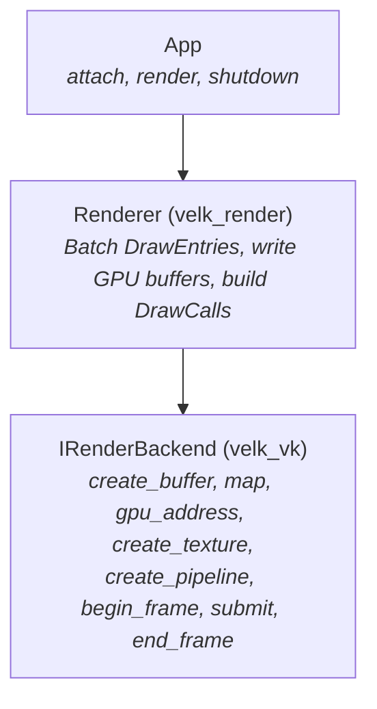
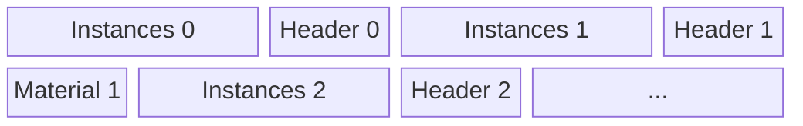
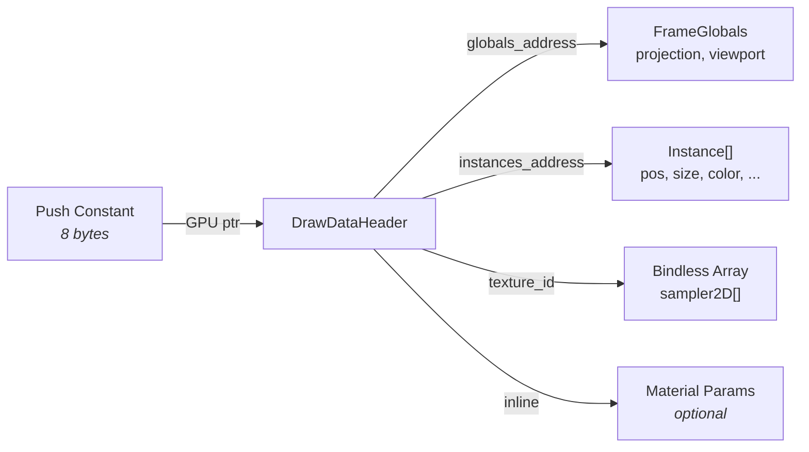
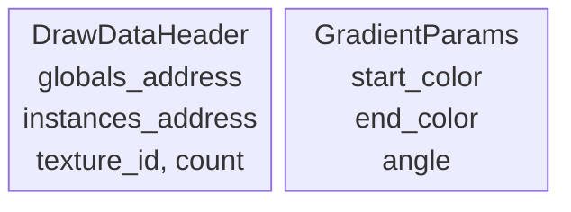
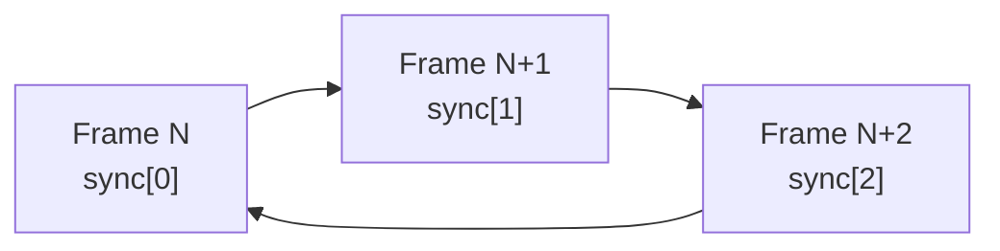

# Velk Render Backend Architecture

A pointer-based GPU rendering abstraction that maps directly to how modern GPUs work, rather than abstracting over graphics API concepts.

Inspired by [No Graphics API](https://www.sebastianaaltonen.com/blog/no-graphics-api) essay, which argues that modern GPU hardware (coherent caches, buffer device addresses, bindless descriptors) has converged enough that the traditional graphics API abstraction layer can be replaced by something much simpler. Velk has no legacy codepath to maintain, so we built the backend around this idea from scratch.

## The Core Idea

Traditional render backends abstract over graphics APIs. They expose concepts like vertex input layouts, uniform buffers, descriptor sets, and pipeline state objects. These concepts exist because GPU hardware used to be diverse: some GPUs had fixed-function vertex fetch, others needed explicit descriptor management, and resource binding models varied wildly.

Modern GPUs have converged. Every current GPU supports:

- **Buffer device addresses**: 64-bit GPU pointers that shaders can dereference
- **Bindless descriptors**: textures accessed by index from a global array
- **Coherent caches**: CPU writes to mapped GPU memory are visible to shaders
- **Programmable vertex fetch**: shaders can read vertex data from arbitrary buffers

When all GPUs support these features, the abstraction layer collapses. Instead of translating between "uniform buffers" and "push constants" and "constant buffers", you just write a struct to a GPU buffer and give the shader a pointer to it. Instead of managing descriptor sets, you give the shader a texture index. Instead of describing vertex layouts, the shader reads what it needs from a buffer.

## Architecture Overview

The system has three layers:



**The app** calls `render()` each frame. It never touches GPU resources directly.

**The renderer** pulls scene state, groups draw entries by pipeline, writes instance data and draw headers into a mapped GPU buffer, and produces an array of `DrawCall` structs.

**The backend** manages Vulkan (or Metal) resources and executes draw calls. It owns the swapchain, synchronization, and all GPU objects. The renderer talks to it through 15 methods.

## The Interface: 15 Methods

The following 15 methods give the renderer everything it needs to put pixels on screen.

```
Lifecycle:  init, shutdown
Surfaces:   create_surface, destroy_surface, resize_surface
Memory:     create_buffer, destroy_buffer, map, gpu_address
Textures:   create_texture, destroy_texture, upload_texture
Pipelines:  create_pipeline, destroy_pipeline
Frame:      begin_frame, submit, end_frame
```

**Memory** (`create_buffer`, `destroy_buffer`, `map`, `gpu_address`) is the foundation. Allocate a GPU buffer, get a CPU pointer to write into it, get the GPU address to pass to shaders. This is the single mechanism for getting all data to the GPU: uniforms, instance data, vertex data, index data, material parameters. One path for everything.

**Textures** (`create_texture`, `destroy_texture`, `upload_texture`) handle image data. `create_texture` returns a `TextureId` which is a `uint32_t` that shaders use directly as an index into a global texture array. Create a texture, get an index, use it in any shader, any draw call. The backend manages the descriptor array internally.

**Pipelines** (`create_pipeline`, `destroy_pipeline`) compile shaders. SPIR-V bytecode in, opaque handle out. The pipeline is just compiled shader code. The shader itself defines what data it reads and how, so the pipeline doesn't need to describe vertex layouts, uniform bindings, or resource layouts.

**Frame** (`begin_frame`, `submit`, `end_frame`) drives presentation. Acquire a swapchain image, submit an array of `DrawCall` structs, present. The backend handles command buffer recording, synchronization, and image transitions internally.

Notably absent: vertex input descriptions, uniform reflection, descriptor set layouts, pipeline layout objects, barrier management, resource state tracking. A typical Vulkan abstraction might expose 40+ methods for these. Here, they're either unnecessary (vertex input, uniform reflection) or hidden inside the backend (barriers, synchronization).

## The DrawCall

```cpp
struct DrawCall
{
    PipelineId pipeline = 0;
    uint32_t vertex_count = 0;
    uint32_t instance_count = 1;
    uint8_t root_constants[128]{};
    uint32_t root_constants_size = 0;
};
```

The `root_constants` field carries up to 128 bytes of data that gets pushed directly to the shader via push constants (Vulkan) or `setBytes` (Metal). 128 bytes is Vulkan's guaranteed minimum push constant size.

In practice, we use 8 of those bytes: a single GPU pointer to a `DrawDataHeader` in the frame buffer. The shader dereferences this pointer to reach all its data.

Why 128 bytes and not just 8? For simple draws that need very little data (a fullscreen clear, a debug line), the shader can read everything directly from push constants without an extra indirection through a GPU buffer.

## Data Flow: How Pixels Get Drawn

### Frame buffer: the bump allocator

The renderer owns two GPU buffers (4 MB each, double-buffered). Each frame it resets an offset to zero and writes data sequentially:



Each write returns the GPU address of what was written. The `DrawDataHeader` contains GPU pointers to the instance data and the globals buffer. This is written last (after instances), and its address goes into the `DrawCall`'s push constants.

### The DrawDataHeader

```cpp
struct DrawDataHeader
{
    uint64_t globals_address;     // GPU pointer to FrameGlobals
    uint64_t instances_address;   // GPU pointer to instance array
    uint32_t texture_id;          // bindless texture index (0 = none)
    uint32_t instance_count;
    uint32_t _pad[2];             // pad to 32 bytes for std430 alignment
};
```

This is the root of the shader's data graph:



From this single pointer, the shader can reach:

1. **Frame globals** (projection matrix, viewport size) via `globals_address`
2. **Instance data** (per-instance position, size, color) via `instances_address`
3. **Texture** via `texture_id` (index into the bindless array)
4. **Material parameters** (if any) which follow inline after the header

### Shader side

The shader declares a matching layout using `buffer_reference`:

```glsl
layout(buffer_reference, std430) readonly buffer Globals {
    mat4 projection;
    vec4 viewport;
};

struct RectInstance {
    vec2 pos;
    vec2 size;
    vec4 color;
};

layout(buffer_reference, std430) readonly buffer RectInstances {
    RectInstance data[];
};

layout(buffer_reference, std430) readonly buffer DrawData {
    Globals globals;
    RectInstances instances;
    uint texture_id;
    uint instance_count;
};

layout(push_constant) uniform PC { DrawData root; };
```

The push constant is a single `DrawData` value, which is a `buffer_reference` type (8 bytes, a GPU pointer). The shader dereferences it:

```glsl
void main() {
    vec2 q = kQuad[gl_VertexIndex];
    RectInstance inst = root.instances.data[gl_InstanceIndex];
    gl_Position = root.globals.projection * vec4(inst.pos + q * inst.size, 0, 1);
}
```

One pointer dereference for globals, one for instance data. No descriptor binding, no uniform uploads, no vertex input. The shader reads what it needs from where it needs it.

## Geometry Without Geometry Objects

There is no geometry API. Vertex data, index data, instance data, and uniform data are all just bytes in GPU buffers, addressed by pointers. The shader decides what to read.

### 2D UI: Procedural quads

Built-in UI visuals don't use geometry buffers at all. The vertex shader generates a quad from `gl_VertexIndex`:

```glsl
const vec2 kQuad[6] = vec2[6](
    vec2(0, 0), vec2(1, 0), vec2(1, 1),
    vec2(0, 0), vec2(1, 1), vec2(0, 1)
);
```

Six vertices, two triangles, one quad. Instance data provides position and size. The draw call is `vertex_count=6, instance_count=N`.

### 3D meshes: Vertex pulling

For 3D content, mesh vertex and index data live in GPU buffers. The draw data struct contains pointers to them:

```cpp
struct MeshDrawData
{
    uint64_t globals_address;
    uint64_t vertices_address;    // Vertex[]
    uint64_t indices_address;     // uint32_t[]
    uint64_t instances_address;   // MeshInstance[] (transforms)
    uint32_t texture_id;
};
```

The shader fetches vertices by index:

```glsl
void main() {
    uint idx = root.indices.i[gl_VertexIndex];
    Vertex v = root.vertices.v[idx];
    gl_Position = root.globals.projection * inst.transform * vec4(v.position, 1);
}
```

The draw call is `vertex_count=index_count, instance_count=M`. Same submit path as 2D. Same interface. Adding new geometry types (line strips, point clouds, terrain) never requires backend changes.

## Materials: Inline GPU Data

Materials override a visual's pipeline and can provide additional GPU data. The `IMaterial` interface has two methods:

```cpp
virtual uint64_t get_pipeline_handle(IRenderContext& ctx) = 0;
virtual size_t get_gpu_data(void* out, size_t max_size) const { return 0; }
```

`get_gpu_data` writes material-specific parameters (colors, angles, whatever the shader needs) into a buffer. The renderer writes this data immediately after the `DrawDataHeader` in the frame buffer. The material's shader knows the layout because it's defined alongside the shader:



No uniform reflection. No name-based binding. No type introspection. The CPU struct and the GLSL layout are maintained in parallel, and std430 packing rules ensure they match.

## Textures: Bindless by Default

`create_texture` returns a `TextureId` which is a `uint32_t`. This value is directly usable as an index in the shader:

```glsl
layout(set = 0, binding = 0) uniform sampler2D velk_textures[];

float alpha = texture(velk_textures[nonuniformEXT(texture_id)], uv).r;
```

The backend maintains a single global descriptor set with a variable-length sampler array. When a texture is created, it gets the next available slot. The slot index IS the `TextureId`. No descriptor set updates from the caller's perspective, no binding calls, no slot management.

On the Vulkan side, this uses `VK_EXT_descriptor_indexing` (core in 1.2) with `UPDATE_AFTER_BIND` and `PARTIALLY_BOUND` flags. The descriptor set is bound once per frame and never changes.

## Technical Details

### buffer_reference vs plain structs in GLSL

In GLSL, a `buffer_reference` type is an 8-byte GPU pointer. This distinction matters when building arrays. If an instance type is declared as `buffer_reference`:

```glsl
layout(buffer_reference, std430) readonly buffer RectInstance {  // pointer type, 8 bytes
    vec2 pos;
    vec2 size;
    vec4 color;
};
```

Then an array of `RectInstance` is an array of **pointers** (8 bytes each), not an array of structs (32 bytes each). The GPU reads 8-byte values from the instance buffer, interprets them as addresses, and dereferences them.

Instance types that live inline in a buffer must be plain GLSL structs:

```glsl
struct RectInstance {  // value type, 32 bytes
    vec2 pos;
    vec2 size;
    vec4 color;
};
```

The rule: use `buffer_reference` only for types that represent actual GPU pointers (DrawData, Globals, instance buffer containers). Data that lives inside those buffers is plain structs.

### std430 alignment and the DrawDataHeader

When writing custom materials or draw data, the CPU-side struct layout must match the shader's std430 packing. The key alignment rules:

| GLSL type | Size | Alignment |
|-----------|------|-----------|
| `uint`, `float` | 4 | 4 |
| `vec2` | 8 | 8 |
| `vec3` | 12 | 16 |
| `vec4` | 16 | 16 |
| `buffer_reference` | 8 | 8 |

The `DrawDataHeader` contains two 8-byte pointers and two 4-byte uints, totaling 24 bytes. If material data containing a `vec4` follows immediately, the shader pads the `vec4` to offset 32 (16-byte alignment), but the CPU would write it at offset 24.

To prevent this mismatch, `DrawDataHeader` is padded to 32 bytes:

```cpp
struct DrawDataHeader
{
    uint64_t globals_address;     // 8 bytes, offset 0
    uint64_t instances_address;   // 8 bytes, offset 8
    uint32_t texture_id;          // 4 bytes, offset 16
    uint32_t instance_count;      // 4 bytes, offset 20
    uint32_t _pad[2];             // 8 bytes, offset 24 (pad to 32)
};
```

This ensures any material data that follows starts at a 16-byte boundary. When writing custom draw data, keep this alignment in mind: if your data follows a `DrawDataHeader`, your first field is at offset 32.

### Color space

The swapchain uses `VK_FORMAT_B8G8R8A8_UNORM`. Colors in shaders pass through to the framebuffer without gamma correction. This means colors are treated as sRGB values throughout: the JSON scene files, the C++ color structs, and the shader output are all in the same space.

If you need linear-space rendering (e.g. for physically based lighting in 3D), switch to `VK_FORMAT_B8G8R8A8_SRGB` and ensure all color inputs are in linear space. The current setup is optimized for UI where colors are specified as sRGB values.

### Frame synchronization

The backend uses 3 overlapping frame sync sets, each containing a fence, an acquire semaphore, a render semaphore, and a command buffer. The index advances each frame:



At the start of each frame, the backend waits on the current set's fence, which guarantees that the command buffer and semaphores from 3 frames ago are no longer in use. This matches the typical swapchain image count (3 with FIFO present mode) and avoids semaphore reuse conflicts with the present engine.

### Render pass setup

Vulkan pipelines reference a render pass at creation time. The backend creates a "default" render pass during `init()` (before any swapchain exists) so that pipelines can be compiled early. This render pass must be compatible with the swapchain render pass created later, which means matching attachment formats and subpass dependency counts.

## What This Enables

The interface is 15 methods. A new backend (Metal, D3D12) implements those 15 methods and everything works. There is no backend-specific abstraction leaking into the renderer or the app.

Adding a new visual type means writing a shader and a struct. No interface changes, no backend changes, no pipeline layout changes.

Adding a new material means implementing `get_pipeline_handle` and `get_gpu_data`. The shader reads the data from the same root pointer as everything else.

Compute shaders, mesh shaders, ray tracing: they all operate on the same GPU buffers via the same pointers. The interface doesn't need to know about these dispatch models because it doesn't own the data layout. The shader does.

## Vulkan Implementation Details

The Vulkan backend (`velk_vk`) uses:

- **Vulkan 1.2** with `bufferDeviceAddress`, `descriptorIndexing`, `shaderSampledImageArrayNonUniformIndexing`
- **VMA** (Vulkan Memory Allocator) for all allocations, with `VMA_ALLOCATOR_CREATE_BUFFER_DEVICE_ADDRESS_BIT`
- **volk** for function loading (no link-time Vulkan dependency)
- **Persistent mapping** via `VMA_ALLOCATION_CREATE_MAPPED_BIT` + `VMA_ALLOCATION_CREATE_HOST_ACCESS_SEQUENTIAL_WRITE_BIT`
- **Push constants** (128 bytes, `VK_SHADER_STAGE_ALL`) for root data pointer
- **Global descriptor set** with variable-length `sampler2D` array (1024 max)
- **Empty vertex input** (all pipelines use `VK_PRIMITIVE_TOPOLOGY_TRIANGLE_LIST` with programmatic vertex generation)
- **Single shared pipeline layout** (push constants + bindless descriptor set)

All synchronization is internal. The backend manages fences, semaphores, command buffer recording, and image layout transitions. None of this is exposed to the renderer.

## Future: Metal Backend

Metal 3 on Apple Silicon supports:

- `MTLBuffer.gpuAddress` for buffer device addresses
- Argument buffers for bindless textures
- `MTLResourceStorageModeShared` for persistently mapped CPU/GPU memory
- MSL device pointers for the same shader data access pattern

The 15-method interface maps naturally to Metal. The shader data model (push constants = `setBytes`, buffer pointers, bindless textures) translates directly.
