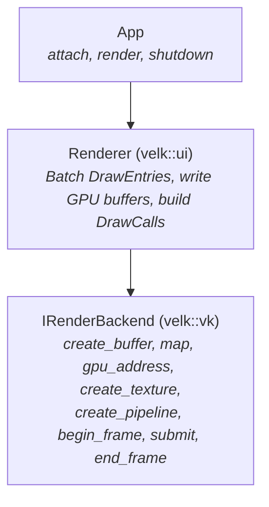
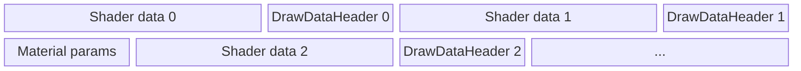
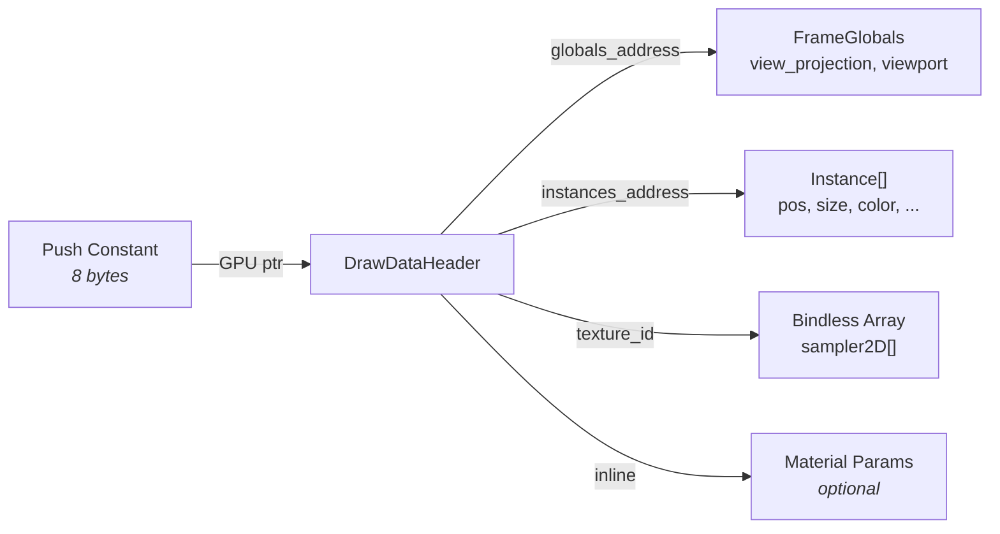
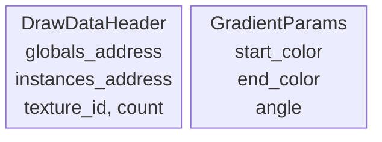
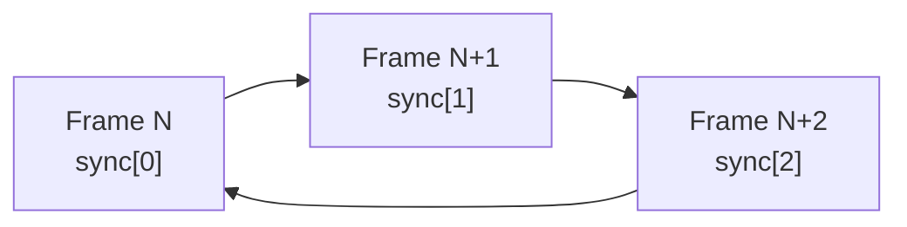

# Velk Render Backend Architecture

A pointer-based GPU rendering abstraction that maps directly to how modern GPUs work, rather than abstracting over graphics API concepts. For frame lifecycle (prepare/present split, threading, multi-rate rendering), see [Rendering](rendering.md).

Inspired by [No Graphics API](https://www.sebastianaaltonen.com/blog/no-graphics-api) essay, which argues that modern GPU hardware (coherent caches, buffer device addresses, bindless descriptors) has converged enough that the traditional graphics API abstraction layer can be replaced by something much simpler. Velk has no legacy codepath to maintain, so the backend could be built around this idea from the start.

## The Core Idea

Traditional render backends abstract over graphics APIs. They expose concepts like vertex input layouts, uniform buffers, descriptor sets, and pipeline state objects. These concepts exist because GPU hardware used to be diverse: some GPUs had fixed-function vertex fetch, others needed explicit descriptor management, and resource binding models varied wildly.

Modern GPUs have converged. Every current GPU supports:

- **Buffer device addresses**: 64-bit GPU pointers that shaders can dereference
- **Bindless descriptors**: textures accessed by index from a global array
- **Coherent caches**: CPU writes to mapped GPU memory are visible to shaders
- **Programmable vertex fetch**: shaders can read vertex data from arbitrary buffers

When all GPUs support these features, the abstraction layer collapses. Instead of translating between "uniform buffers" and "push constants" and "constant buffers", you just write a struct to a GPU buffer and give the shader a pointer to it:
* Instead of managing descriptor sets, you give the shader a texture index. 
* Instead of describing vertex layouts, the shader reads what it needs from a buffer.

## Architecture Overview

The system has three layers:



| Layer | Task |
|--|--|
| App | Calls `render()` each frame. It never touches GPU resources directly. |
| Renderer | Pulls scene state, groups draw entries by pipeline, writes instance data and draw headers into a mapped GPU buffer, and produces an array of `DrawCall` structs.<br>Current `ClassId::Renderer` implementation lives in velk-ui for the UI framework use cases. There could also be other IRenderer implementations optimized more e.g. for 3D. |
| Backend | manages resources and executes draw calls. It owns the swapchain, synchronization, and all GPU objects. The renderer talks to it through IRenderbackend.<br>Several backend implementations can exist for different graphics APIs (e.g. Vulkan, D3D12 or Metal) |

## IRenderBackend interface

The following methods from `IRenderBackend` give the renderer everything it needs to put pixels on screen.

| Method | Purpose |
|--|--|
| Lifecycle | `init`, `shutdown` |
| Surfaces |  `create_surface`, `destroy_surface`, `resize_surface` |
| Memory | `create_buffer`, `destroy_buffer`, `map`, `gpu_address` |
| Textures | `create_texture`, `destroy_texture`, `upload_texture` |
| Pipelines | `create_pipeline`, `destroy_pipeline` |
| Frame | `begin_frame`, `submit`, `end_frame` |

**Memory** is the foundation:
* `create_buffer`: Allocate a GPU buffer
* `destroy_buffer`: Deallocate a GPU buffer
* `map`: Cet a CPU pointer to write into a buffer
* `gpu_address`: Get the GPU address to pass to shaders

This is the single mechanism for getting all data to the GPU: uniforms, instance data, vertex data, index data, material parameters.

**Texture** handling:
* `create_texture`: Create a texture and return a `TextureId`, a `uint32_t` that shaders use directly as an index into a global texture array.
* `destroy_texture`: Destroy a texture.
* `upload_texture`: Upload pixel data to the texture via a staging buffer. 

The texture id (or index) can be used in any shader and any draw call. The backend manages the descriptor array internally.

**Pipelines** link shaders:
* `create_pipeline`: Creates a pipeline from compiled shader bytecode and a topology (triangle strip or triangle list). Returns an opaque handle.
* `destroy_pipeline`: Destroy a pipeline

The shader itself defines what data it reads and how (as everything is available through the memory buffers), so the pipeline doesn't need to describe vertex layouts, uniform bindings, or resource layouts.

Above the backend, `IRenderContext` provides a higher-level API that separates shader compilation from pipeline creation:

* `compile_shader(source, stage)`: Compiles GLSL source to an `IShader::Ptr` handle that owns the compiled bytecode
* `create_pipeline(vertex, fragment)`: Links two compiled shaders into a pipeline. Passing nullptr for either shader substitutes the registered default
* `compile_pipeline(frag_source, vert_source)`: Convenience that compiles and links in one call

The UI renderer registers default vertex and fragment shaders during setup. This means materials typically only need to provide a fragment shader.

**Frame** drives presentation:
* `begin_frame`: To acquire a swapchain image.
* `submit`: An array of `DrawCall` structs.
* `end_frame`: present.

The backend handles command buffer recording, synchronization, and image transitions internally.

### What is not there (on purpose)

Notably absent: 
* vertex input descriptions
* descriptor set layouts
* pipeline layout objects
* barrier management
* resource state tracking
* uniform reflection (with the exception of [ShaderMaterial](./materials.md))

A typical Vulkan abstraction might expose 40+ methods for these. Here, they're either unnecessary (vertex input, uniform reflection) or hidden inside the backend (barriers, synchronization).

## The DrawCall

```cpp
struct DrawCall
{
    PipelineId pipeline = 0;
    uint32_t vertex_count = 0;
    uint32_t instance_count = 1;
    uint8_t root_constants[128]{};
    uint32_t root_constants_size = 0;
};
```

The `root_constants` field carries up to 128 bytes of data that gets pushed directly to the shader via push constants (Vulkan) or `setBytes` (Metal). 128 bytes is Vulkan's guaranteed minimum push constant size.

In practice only 8 of those bytes are used: a single GPU pointer to a `DrawDataHeader` in the per-frame staging buffer. The shader dereferences this pointer to reach all its data.

Why 128 bytes and not just 8? For simple draws that need very little data (a fullscreen clear, a debug line), the shader can read everything directly from push constants without an extra indirection through a GPU buffer.

## Data Flow: How Pixels Get Drawn

### Per-frame staging buffer

The renderer owns two GPU staging buffers (double-buffered, starting at 256 KB and growing on demand). Each frame it resets an offset to zero and writes data sequentially:



- **Shader data**: whatever the draw call's shader reads via pointer. For 2D UI this is instance arrays (position, size, color per quad). For 3D meshes it could be per-instance transforms or vertex/index buffers.
- **DrawDataHeader**: the root struct that the shader receives a pointer to. Contains GPU addresses pointing to the shader data and globals, plus a texture index. Material-specific parameters (if any) follow inline after the header.

Each write returns the GPU address of what was written. The DrawDataHeader is written last (after shader data), and its address goes into the `DrawCall`'s push constants.

#### Note

The velk-ui `ClassId::Renderer` currently re-assembles the whole staging buffer every frame:
* velk-ui Scene maintains a list of IVisuals in draw-order, iterating them is relatively cheap.
* Visuals access their data through Velk object state access, offering nearly zero overhead access to object's property values, making draw call assembly cheap.

That said, this can be improved in the future by caching parts of the staging buffer that has not changed at all since the previous frame.

### The DrawDataHeader

The DrawDataHeader is the root of the shader's data graph. The push constant carries a single GPU pointer to it, and from there the shader can reach everything it needs:



The C++ struct and the shader's `buffer_reference` layout mirror each other:

```cpp
// C++ (gpu_data.h)

VELK_GPU_STRUCT DrawDataHeader
{
    uint64_t globals_address;
    uint64_t instances_address;
    uint32_t texture_id;
    uint32_t instance_count;
};
```

```glsl
// GLSL (velk.glsl provides the VELK_DRAW_DATA macro)

layout(buffer_reference, std430) readonly buffer DrawData {
    VELK_DRAW_DATA(RectInstanceData)       // globals, instances, texture_id, count, padding
    vec4 start_color;                   // optional material params follow
};

layout(push_constant) uniform PC { DrawData root; };
```

The `VELK_DRAW_DATA` macro expands to the standard header fields (globals pointer, instances pointer, texture id, instance count, and padding to 32 bytes). Material-specific fields follow after the macro. The C++ side writes addresses and indices; the GLSL side declares the same fields as `buffer_reference` types, so dereferencing `root.global_data` follows the GPU pointer to `FrameGlobals`. No descriptor binding, no uniform uploads, no vertex input.

For fragment shaders that only read material parameters, use `Ptr64` as the instances type to skip over the pointer fields without declaring instance types:

```glsl
layout(buffer_reference, std430) readonly buffer DrawData {
    VELK_DRAW_DATA(Ptr64)
    vec4 start_color;
};
```

### Instance data

The `instances_address` in the header points to an array of per-instance structs. Each visual type defines a C++ struct (in `instance_types.h`) that mirrors the GLSL layout:

```cpp
// C++ (instance_types.h)

struct RectInstance
{
    vec2 pos;
    vec2 size;
    color col;
};
```

```glsl
// GLSL (declared by the shader or provided by velk-ui.glsl)

struct RectInstance {
    vec2 pos;
    vec2 size;
    vec4 color;
};

layout(buffer_reference, std430) readonly buffer RectInstanceData {
    RectInstance data[];
};
```

Visuals pack instance data using the C++ struct via `DrawEntry::set_instance()`:

```cpp
entry.set_instance(RectInstance{
    {bounds.x, bounds.y},
    {bounds.width, bounds.height},
    state->color});
```

The renderer concatenates these structs into a GPU buffer and writes the buffer's address into `DrawDataHeader::instances_address`. The shader reads them back through the matching GLSL struct. The `static_assert` on each C++ struct's size ensures the layouts stay in sync.

Material parameters use the same pattern: a C++ struct (`VELK_GPU_STRUCT`) mirrors the GLSL layout and is written via `write_gpu_data()`. See [Materials](./materials.md) for details.

### Shader includes

The shader compiler resolves `#include` directives against built-in virtual include files. Two are provided:

| Include | Source | Provides |
|--|--|--|
| `velk.glsl` | velk-render (always available) | `GlobalData` buffer reference, `Ptr64` dummy pointer, `velk_unit_quad()`, `VELK_DRAW_DATA()`, buffer_reference extensions |
| `velk-ui.glsl` | velk-ui (registered by the UI renderer) | `RectInstance`, `TextInstance`, `RectInstanceData`, `TextInstanceData` |

Modules can register additional includes via `IRenderContext::register_shader_include()`.

With these includes, a complete UI vertex shader only needs its `DrawData` layout and `main()`:

```glsl
#version 450
#include "velk.glsl"
#include "velk-ui.glsl"

layout(buffer_reference, std430) readonly buffer DrawData {
    VELK_DRAW_DATA(RectInstanceData)
};

layout(push_constant) uniform PC { DrawData root; };

void main()
{
    vec2 q = velk_unit_quad(gl_VertexIndex);
    RectInstance inst = root.instance_data.data[gl_InstanceIndex];
    gl_Position = root.global_data.view_projection * vec4(inst.pos + q * inst.size, 0, 1);
}
```

## Geometry Without Geometry Objects

There is no geometry API. Vertex data, index data, instance data, and uniform data are all just bytes in GPU buffers, addressed by pointers. The shader decides what to read.

### 2D UI: Procedural quads

Built-in UI visuals don't use geometry buffers at all. The vertex shader generates a unit quad from `gl_VertexIndex` using `velk_unit_quad()` (provided by `velk.glsl`):

```glsl
vec2 q = velk_unit_quad(gl_VertexIndex); // (0,0), (1,0), (0,1), (1,1)
```

Four vertices for one quad. Instance data provides position and size. The draw call is `vertex_count=4, instance_count=N`.

### 3D meshes: Vertex pulling

For 3D content, mesh vertex and index data live in GPU buffers. The draw data struct contains pointers to them:

```cpp
struct MeshDrawData
{
    uint64_t globals_address;
    uint64_t vertices_address;    // Vertex[]
    uint64_t indices_address;     // uint32_t[]
    uint64_t instances_address;   // MeshInstance[] (transforms)
    uint32_t texture_id;
};
```

The shader fetches vertices by index:

```glsl
void main() {
    uint idx = root.indices.i[gl_VertexIndex];
    Vertex v = root.vertices.v[idx];
    gl_Position = root.global_data.view_projection * inst.transform * vec4(v.position, 1);
}
```

The draw call is `vertex_count=index_count, instance_count=M`. Same submit path as 2D. Same interface. Adding new geometry types (line strips, point clouds, terrain) never requires backend changes.

## Materials: Inline GPU Data

Materials override a visual's pipeline and can provide additional GPU data. The `IMaterial` interface has two methods:

```cpp
virtual uint64_t get_pipeline_handle(IRenderContext& ctx) = 0;
virtual size_t gpu_data_size() const { return 0; }
virtual void write_gpu_data(void* out) const {}
```

The renderer asks the material for its data size, reserves contiguous space in the staging buffer for the header + material data, and lets the material write directly:

```cpp
// In the renderer's draw call builder:
size_t mat_size = material ? material->gpu_data_size() : 0;
size_t total_size = sizeof(DrawDataHeader) + mat_size;

// Reserve contiguous space in staging buffer
auto* dst = staging_ptr + write_offset_;
memcpy(dst, &header, sizeof(header));                    // bytes 0..31
if (mat_size > 0) {
    material->write_gpu_data(dst + sizeof(DrawDataHeader));  // bytes 32..N
}
```

The material's implementation writes its own struct:

```cpp
size_t GradientMaterial::gpu_data_size() const { return sizeof(GradientParams); }

void GradientMaterial::write_gpu_data(void* out, size_t size) const
{
    if (size != sizeof(GradientParams)) {
        return;
    }
    auto& p = *static_cast<GradientParams*>(out);
    if (auto r = velk::read_state<IMaterial>(this)) {
        p.start_color = { ... };
        p.end_color = { ... };
        p.angle = ...;
    } else {
        p = {};
    }
}
```

The result in GPU memory:



The shader's `DrawData` layout declares matching fields after the standard header fields. The CPU struct sizes and the GLSL std430 layout must agree (see the alignment section below).

No uniform reflection, name-based binding or type introspection. Each material defines a C++ struct and a matching GLSL layout, and `get_gpu_data` is the bridge between them.

## Textures: Bindless by Default

`create_texture` returns a `TextureId` which is a `uint32_t`. This value is directly usable as an index in the shader:

```glsl
layout(set = 0, binding = 0) uniform sampler2D velk_textures[];

float alpha = texture(velk_textures[nonuniformEXT(texture_id)], uv).r;
```

The backend maintains a single global descriptor set with a variable-length sampler array. When a texture is created, it gets the next available slot. The slot index IS the `TextureId`. No descriptor set updates from the caller's perspective, no binding calls, no slot management.

On the Vulkan side, this uses `VK_EXT_descriptor_indexing` (core in 1.2) with `UPDATE_AFTER_BIND` and `PARTIALLY_BOUND` flags. The descriptor set is bound once per frame and never changes.

## Technical Details

### buffer_reference vs plain structs in GLSL

In GLSL, a `buffer_reference` type is an 8-byte GPU pointer. This distinction matters when building arrays. If an instance type is declared as `buffer_reference`:

```glsl
layout(buffer_reference, std430) readonly buffer RectInstance {  // pointer type, 8 bytes
    vec2 pos;
    vec2 size;
    vec4 color;
};
```

Then an array of `RectInstance` is an array of **pointers** (8 bytes each), not an array of structs (32 bytes each). The GPU reads 8-byte values from the instance buffer, interprets them as addresses, and dereferences them.

Instance types that live inline in a buffer must be plain GLSL structs:

```glsl
struct RectInstance {  // value type, 32 bytes
    vec2 pos;
    vec2 size;
    vec4 color;
};
```

The rule: use `buffer_reference` only for types that represent actual GPU pointers (DrawData, GlobalData, instance buffer containers). Data that lives inside those buffers is plain structs.

### std430 alignment and the DrawDataHeader

When writing custom materials or draw data, the CPU-side struct layout must match the shader's std430 packing. The key alignment rules:

| GLSL type | Size | Alignment |
|-----------|------|-----------|
| `uint`, `float` | 4 | 4 |
| `vec2` | 8 | 8 |
| `vec3` | 12 | 16 |
| `vec4` | 16 | 16 |
| `buffer_reference` | 8 | 8 |

The `DrawDataHeader` contains two 8-byte pointers and two 4-byte uints, totaling 24 bytes. If material data containing a `vec4` follows immediately, the shader pads the `vec4` to offset 32 (16-byte alignment), but the CPU would write it at offset 24.

To prevent this mismatch, `DrawDataHeader` uses `VELK_GPU_STRUCT` (which applies `alignas(16)`) to pad the struct to 32 bytes:

```cpp
VELK_GPU_STRUCT DrawDataHeader
{
    uint64_t globals_address;     // 8 bytes, offset 0
    uint64_t instances_address;   // 8 bytes, offset 8
    uint32_t texture_id;          // 4 bytes, offset 16
    uint32_t instance_count;      // 4 bytes, offset 20
                                  // 8 bytes padding (compiler-inserted)
};
```

This ensures any material data that follows starts at a 16-byte boundary. Custom material structs should also use `VELK_GPU_STRUCT` so the compiler handles padding automatically. If your data follows a `DrawDataHeader`, your first field is at offset 32.

### Color space

The swapchain uses `VK_FORMAT_B8G8R8A8_UNORM`. Colors in shaders pass through to the framebuffer without gamma correction. This means colors are treated as sRGB values throughout: the JSON scene files, the C++ color structs, and the shader output are all in the same space.

If you need linear-space rendering (e.g. for physically based lighting in 3D), switch to `VK_FORMAT_B8G8R8A8_SRGB` and ensure all color inputs are in linear space. The current setup is optimized for UI where colors are specified as sRGB values.

### Frame synchronization

The backend uses 3 overlapping frame sync sets, each containing a fence, an acquire semaphore, a render semaphore, and a command buffer. The index advances each frame:



At the start of each frame, the backend waits on the current set's fence, which guarantees that the command buffer and semaphores from 3 frames ago are no longer in use. This matches the typical swapchain image count (3 with FIFO present mode) and avoids semaphore reuse conflicts with the present engine.

### Render pass setup

Vulkan pipelines reference a render pass at creation time. The backend creates a "default" render pass during `init()` (before any swapchain exists) so that pipelines can be compiled early. This render pass must be compatible with the swapchain render pass created later, which means matching attachment formats and subpass dependency counts.

## What This Enables

The interface is 15 methods. A new backend (Metal, D3D12) implements those 15 methods and everything works. There is no backend-specific abstraction leaking into the renderer or the app.

Adding a new visual type means writing a shader and a struct. No interface changes, backend changes, or pipeline layout changes are needed.

Adding a new material means implementing `get_pipeline_handle` and `get_gpu_data`. The shader reads the data from the same root pointer as everything else.

Compute shaders, mesh shaders, ray tracing: they all operate on the same GPU buffers via the same pointers. The interface doesn't need to know about these dispatch models because it doesn't own the data layout. The shader does.

## Vulkan Implementation Details

The Vulkan backend (`velk::vk`) uses:

- **Vulkan 1.2** with `bufferDeviceAddress`, `descriptorIndexing`, `shaderSampledImageArrayNonUniformIndexing`
- **VMA** (Vulkan Memory Allocator) for all allocations, with `VMA_ALLOCATOR_CREATE_BUFFER_DEVICE_ADDRESS_BIT`
- **volk** for function loading (no link-time Vulkan dependency)
- **Persistent mapping** via `VMA_ALLOCATION_CREATE_MAPPED_BIT` + `VMA_ALLOCATION_CREATE_HOST_ACCESS_SEQUENTIAL_WRITE_BIT`
- **Push constants** (128 bytes, `VK_SHADER_STAGE_ALL`) for root data pointer
- **Global descriptor set** with variable-length `sampler2D` array (1024 max)
- **Empty vertex input** with per-pipeline topology (triangle strip for UI quads, triangle list for meshes)
- **Single shared pipeline layout** (push constants + bindless descriptor set)

All synchronization is internal. The backend manages fences, semaphores, command buffer recording, and image layout transitions. None of this is exposed to the renderer.

## Future: Metal Backend

Metal 3 on Apple Silicon supports:

- `MTLBuffer.gpuAddress` for buffer device addresses
- Argument buffers for bindless textures
- `MTLResourceStorageModeShared` for persistently mapped CPU/GPU memory
- MSL device pointers for the same shader data access pattern

The 15-method interface maps naturally to Metal. The shader data model (push constants = `setBytes`, buffer pointers, bindless textures) translates directly.
