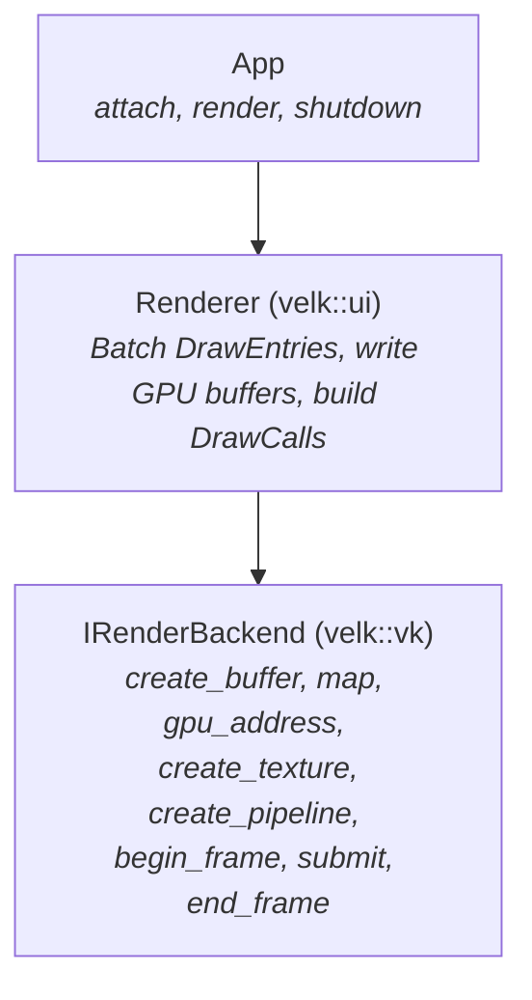
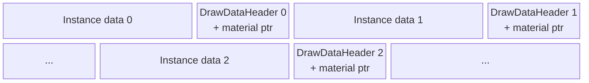
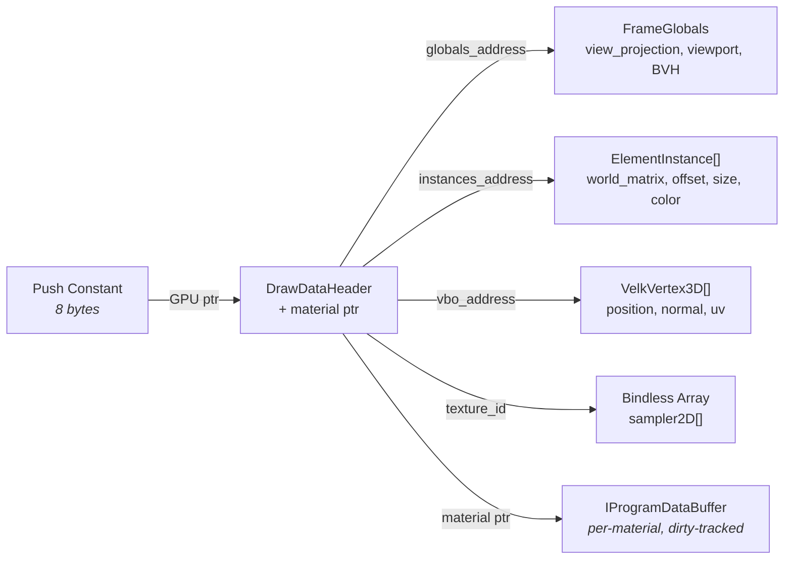
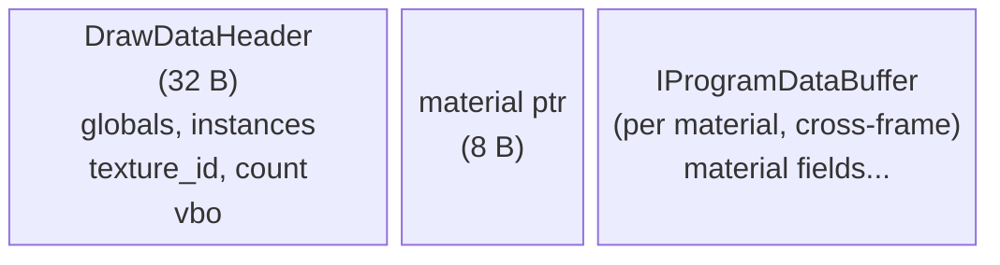
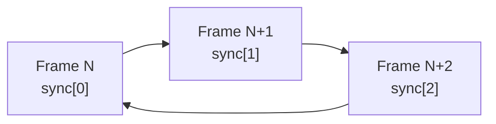

# Velk Render Backend Architecture

A bindless GPU rendering abstraction that maps directly to how modern GPUs work, rather than abstracting over graphics API concepts. For frame lifecycle (prepare/present split, threading, multi-rate rendering), see [Rendering](rendering.md).

The archicture was inspired by [No Graphics API](https://www.sebastianaaltonen.com/blog/no-graphics-api) essay by Sebastian Aaltonen. It argues that modern GPU hardware (coherent caches, buffer device addresses, bindless descriptors) has converged enough that the traditional graphics API abstraction layer can be replaced by something much simpler. Velk has no legacy codepath to maintain, so why not try something different (and hopefully simpler).

## Contents
- [Bindless?](#bindless)
- [The Core Idea](#the-core-idea)
- [Architecture Overview](#architecture-overview)
- [IRenderBackend interface](#irenderbackend-interface)
  - [What is not there (on purpose)](#what-is-not-there-on-purpose)
- [The DrawCall](#the-drawcall)
- [Data Flow: How Pixels Get Drawn](#data-flow-how-pixels-get-drawn)
  - [Per-frame staging buffer](#per-frame-staging-buffer)
    - [Note](#note)
  - [The DrawDataHeader](#the-drawdataheader)
  - [Instance data](#instance-data)
  - [Shader includes](#shader-includes)
- [Geometry Without Geometry Objects](#geometry-without-geometry-objects)
  - [2D UI: Procedural quads](#2d-ui-procedural-quads)
  - [3D meshes: Vertex pulling](#3d-meshes-vertex-pulling)
- [Materials: Inline GPU Data](#materials-inline-gpu-data)
- [Textures: Bindless by Default](#textures-bindless-by-default)
- [Technical Details](#technical-details)
  - [buffer_reference vs plain structs in GLSL](#bufferreference-vs-plain-structs-in-glsl)
  - [std430 alignment and the DrawDataHeader](#std430-alignment-and-the-drawdataheader)
  - [Color space](#color-space)
  - [Frame synchronization](#frame-synchronization)
  - [Render pass setup](#render-pass-setup)
- [What This Enables](#what-this-enables)
- [Vulkan Implementation Details](#vulkan-implementation-details)
- [Future: Metal Backend](#future-metal-backend)


## Bindless?

"Bindless" traditionally refers to accessing GPU resources (textures, buffers) by address or index rather than binding them to fixed slots before each draw call. Velk's render backend takes this approach across the board:

  * **Bindless textures**: all textures live in a global array, accessed by index. One descriptor set bind per frame, zero per draw call.
  * **Bindless buffers**: all shader data (instance arrays, material parameters, glyph tables, mesh vertices) is accessed via `buffer_reference` GPU pointers. Shaders navigate a pointer graph starting from a single push constant root address.
  * **No descriptor set switching per draw**: each draw call receives one 8-byte push constant (a GPU address). The shader dereferences it to reach everything it needs.
  * **No vertex buffer binding**: there are no VAOs, vertex attribute descriptions or `vkCmdBindVertexBuffers`. Pipelines have empty vertex input state. 2D geometry is procedural (unit quads expanded in the vertex shader), 3D geometry uses vertex pulling from GPU buffers.
  * **Inline per-frame data**: all per-draw data (draw headers, instance arrays, material parameters) is written sequentially into a single persistently mapped GPU staging buffer using a bump allocator. This means that per-frame allocations, staging copies or command buffer transfers are not needed.

The result is that the per-draw-call CPU cost is dominated by the `vkCmdPushConstants` + `vkCmdDraw` calls themselves, which is the theoretical minimum. On the GPU side, the pointer dereference for draw data is a single memory load from L2-cached memory, comparable to a traditional uniform buffer read.

However, this is *not* GPU-driven rendering (yet). The CPU still decides what to draw and builds the draw call list. The GPU does not perform culling, sorting, or indirect dispatch. The "bindless" label describes the resource access model: once data is in GPU memory, shaders reach it by address, not by API-managed binding.

## The Core Idea

Traditional render backends abstract over graphics APIs. They expose concepts like vertex input layouts, uniform buffers, descriptor sets, and pipeline state objects. These concepts exist because GPU hardware used to be diverse: some GPUs had fixed-function vertex fetch, others needed explicit descriptor management, and resource binding models varied wildly.

Modern GPUs have converged. Every current GPU supports:

- **Buffer device addresses**: 64-bit GPU pointers that shaders can dereference
- **Bindless descriptors**: textures accessed by index from a global array
- **Coherent caches**: CPU writes to mapped GPU memory are visible to shaders
- **Programmable vertex fetch**: shaders can read vertex data from arbitrary buffers

When all GPUs support these features, the abstraction layer collapses. Instead of translating between "uniform buffers" and "push constants" and "constant buffers", you just write a struct to a GPU buffer and give the shader a pointer to it:
* Instead of managing descriptor sets, you give the shader a texture index. 
* Instead of describing vertex layouts, the shader reads what it needs from a buffer.

## Architecture Overview

The system has three layers:



| Layer | Task |
|--|--|
| App | Calls `render()` each frame. It never touches GPU resources directly. |
| Renderer | Pulls scene state, groups draw entries by pipeline, writes instance data and draw headers into a mapped GPU buffer, and produces an array of `DrawCall` structs.<br>Current `ClassId::Renderer` implementation lives in velk-ui for the UI framework use cases. There could also be other IRenderer implementations optimized more e.g. for 3D. |
| Backend | manages resources and executes draw calls. It owns the swapchain, synchronization, and all GPU objects. The renderer talks to it through IRenderbackend.<br>Several backend implementations can exist for different graphics APIs (e.g. Vulkan, D3D12 or Metal) |

## IRenderBackend interface

The following methods from `IRenderBackend` give the renderer everything it needs to put pixels on screen.

| Category | Methods |
|--|--|
| Lifecycle | `init`, `shutdown` |
| Surfaces | `create_surface`, `destroy_surface`, `resize_surface` |
| GPU memory | `create_buffer`, `destroy_buffer`, `map`, `gpu_address` |
| Textures | `create_texture`, `destroy_texture`, `upload_texture` |
| MRT groups | `create_render_target_group`, `destroy_render_target_group`, `get_render_target_group_attachment` |
| Pipelines | `create_pipeline`, `create_compute_pipeline`, `destroy_pipeline` |
| Frame lifecycle | `begin_frame`, `begin_pass`, `submit`, `end_pass`, `dispatch`, `blit_to_surface`, `blit_group_depth_to_surface`, `barrier`, `end_frame` |

**Memory** is the foundation:
* `create_buffer`: Allocate a GPU buffer (`GpuBufferDesc` sets size, CPU-writable flag, index-buffer usage).
* `destroy_buffer`: Deallocate a GPU buffer.
* `map`: Get a CPU pointer to a persistently mapped buffer.
* `gpu_address`: Get the GPU virtual address to pass to shaders via `buffer_reference`.

This is the single mechanism for getting all data to the GPU: frame globals, instance data, vertex data, index data, material parameters.

**Textures** are bindless by design:
* `create_texture`: Create a texture from a `TextureDesc` (dimensions, format, usage — Sampled / RenderTarget / Storage / ColorAttachment) and return a `TextureId`, a `uint32_t` that shaders use directly as an index into a global texture array.
* `destroy_texture`: Destroy a texture and free its bindless slot.
* `upload_texture`: Upload pixel data to the texture via a staging buffer; fills mip 0 and generates the rest via blit-downsampling.

The texture id can be used in any shader and any draw call. The backend manages the descriptor array internally.

**MRT groups** bind multiple color attachments for a single render pass (used by the deferred G-buffer path):
* `create_render_target_group`: Allocate N sampleable color attachments + optional depth, sharing one render pass and framebuffer. Returns a `RenderTargetGroup` handle (distinct from surface / texture IDs).
* `destroy_render_target_group`: Destroy the group, its attachments, its render pass, and its framebuffer.
* `get_render_target_group_attachment`: Return the bindless `TextureId` of attachment `i` so it can be sampled once `end_pass` has transitioned it to `SHADER_READ_ONLY_OPTIMAL`.

**Pipelines** link shaders plus rasterizer state:
* `create_pipeline`: Creates a graphics pipeline from a `PipelineDesc` (vertex + fragment `IShader::Ptr`s plus a `PipelineOptions` struct carrying topology, cull mode, front-face, blend mode, depth test / write). Optional `target_group` compiles against an MRT render pass so the fragment shader can write multiple color outputs; defaults to the single-attachment swapchain pass.
* `create_compute_pipeline`: Creates a compute pipeline from a `ComputePipelineDesc` (compute shader only).
* `destroy_pipeline`: Destroy a graphics or compute pipeline.

The shader itself defines what data it reads and how (everything is available through memory buffers), so the pipeline never describes vertex input layouts, uniform bindings, or resource layouts.

Above the backend, `IRenderContext` provides a higher-level API that separates shader compilation from pipeline creation:

* `compile_shader(source, stage, key = 0)`: Compiles GLSL source to an `IShader::Ptr` handle that owns the compiled bytecode. Consults an on-disk SPIR-V cache before falling back to shaderc — see [Materials → Shader cache](materials.md#shader-cache). Built-in shaders pass a `constexpr make_hash64(source)` as the cache key; leaving `key` as 0 hashes the source at runtime.
* `create_pipeline(vertex, fragment, options)`: Links two compiled shaders into a pipeline with the given `PipelineOptions`. Passing nullptr for either shader substitutes the registered default.
* `compile_pipeline(frag_source, vert_source, options)`: Convenience that compiles and links in one call.

The UI renderer registers default vertex and fragment shaders during setup. This means materials typically only need to provide a fragment shader.

**Frame lifecycle** — a frame is one `begin_frame` / `end_frame` pair around zero or more passes and dispatches:

* `begin_frame`: Waits on the GPU fence for the slot being reused, then starts command buffer recording. Does not acquire the swapchain image (that happens lazily inside `begin_pass` or `blit_to_surface`).
* `begin_pass`: Begins a render pass targeting a surface, an MRT group, or a single render-target texture (the target kind is encoded in the ID). For surface targets, acquires the swapchain image if not already acquired this frame, binds the bindless descriptor set.
* `submit`: Records `DrawCall`s into the current render pass. Takes an optional viewport rect (zero width/height means "full target"). `DrawCall` supports both indexed (`vkCmdDrawIndexed`) and non-indexed (`vkCmdDraw`) draws; the backend picks based on whether `index_buffer` is non-zero.
* `end_pass`: Ends the current render pass. MRT attachments are transitioned to `SHADER_READ_ONLY_OPTIMAL` so the compositor can sample them.
* `dispatch`: Records compute dispatches outside any render pass. Used for ray-trace fill, deferred lighting, shadow resolve. Emits a memory barrier before any subsequent graphics pass samples storage-image outputs.
* `blit_to_surface`: Blits a storage texture onto a surface's swapchain image. Used by the RT / deferred compositor to deliver the final image; mutually exclusive with `begin_pass` on the same surface within a frame.
* `blit_group_depth_to_surface`: Copies an MRT group's depth attachment into a surface's depth buffer so subsequent forward passes can depth-test against the deferred scene.
* `barrier`: Inserts a pipeline barrier between passes — call between `end_pass` and the next `begin_pass` when a pass reads output from the previous one.
* `end_frame`: Ends command recording, submits to the GPU queue, and presents any surfaces that were rendered into this frame.

The backend handles command buffer recording, synchronization, and image layout transitions internally; the renderer only speaks passes, dispatches, and barriers.

### What is not there (on purpose)

Notably absent:
* vertex input descriptions
* descriptor set layouts
* pipeline layout objects
* per-resource layout transitions (the backend derives them from pass targets)
* explicit semaphore / fence management
* uniform reflection (with the exception of [ShaderMaterial](./materials.md))

A typical Vulkan abstraction might expose 40+ methods for these. Here they're either unnecessary (vertex input, uniform reflection) or hidden inside the backend (layouts, synchronization primitives).

## The DrawCall

```cpp
struct DrawCall
{
    PipelineId pipeline{};      ///< Which pipeline to bind.
    uint32_t vertex_count{};    ///< Vertices per instance (non-indexed draws).
    uint32_t instance_count{1}; ///< Number of instances to draw.

    GpuBuffer index_buffer{};         ///< Index buffer to bind (0 = non-indexed draw).
    uint64_t index_buffer_offset{};   ///< Byte offset into index_buffer where indices start.
    uint32_t index_count{};           ///< Indices per instance for indexed draws.

    /// Push constant data, typically an 8-byte GPU pointer to a DrawDataHeader.
    uint8_t  root_constants[kMaxRootConstantsSize]{};
    uint32_t root_constants_size{}; ///< Bytes used in root_constants.
};
```

When `index_buffer` is non-zero the backend dispatches a `vkCmdDrawIndexed(index_count, ...)` after binding the IBO at `index_buffer_offset`. Otherwise it falls through to `vkCmdDraw(vertex_count, ...)`. 3D mesh primitives take the indexed path; the TriangleStrip unit quad and fullscreen effects take the non-indexed path.

The `root_constants` field carries up to `kMaxRootConstantsSize` (256) bytes that get pushed directly to the shader via push constants (Vulkan) or `setBytes` (Metal). 256 is supported by every modern desktop and mobile GPU; Vulkan's guaranteed minimum is 128.

In practice most draws use only 8 of those bytes: a single GPU pointer to a `DrawDataHeader` in the per-frame staging buffer. The shader dereferences this pointer to reach all its data. The rest of the space is there so more elaborate dispatches (ray trace, deferred lighting) can pack multiple addresses directly into push constants and skip the staging-buffer indirection.

## Data Flow: How Pixels Get Drawn

### Per-frame staging buffer

The renderer owns two GPU staging buffers (double-buffered, starting at 256 KB and growing on demand). Each frame it resets an offset to zero and writes data sequentially:



- **Instance data**: the per-instance array the shader reads via `instances_address`. Every visual — 2D or 3D — packs this as an array of `ElementInstance` structs (see [Instance data](#instance-data) below).
- **DrawDataHeader**: the root struct that the shader receives a pointer to. Contains GPU addresses pointing to the instance data, frame globals, and the draw's VBO, plus the bindless texture index. A per-draw 8-byte material pointer is written immediately after the header — material params live in a separate `IProgramDataBuffer` (dirty-tracked across frames) reached through that pointer.

Each write returns the GPU address of what was written. The DrawDataHeader + material-pointer pair is written last (after the instance data), and its address goes into the `DrawCall`'s push constants.

#### Note

The velk-ui `ClassId::Renderer` currently re-assembles the whole staging buffer every frame:
* velk-ui Scene maintains a list of IVisuals in draw-order, iterating them is relatively cheap.
* Visuals access their data through Velk object state access, offering nearly zero overhead access to object's property values, making draw call assembly cheap.

That said, this can be improved in the future by caching parts of the staging buffer that has not changed at all since the previous frame.

### The DrawDataHeader

The DrawDataHeader is the root of the shader's data graph. The push constant carries a single GPU pointer to it, and from there the shader can reach everything it needs:



The C++ struct and the shader's `buffer_reference` layout mirror each other:

```cpp
// C++ (velk-render/gpu_data.h)

VELK_GPU_STRUCT DrawDataHeader
{
    uint64_t globals_address;    ///< -> FrameGlobals
    uint64_t instances_address;  ///< -> ElementInstance[]
    uint32_t texture_id;         ///< bindless index, 0 = none
    uint32_t instance_count;
    uint64_t vbo_address;        ///< -> bound VBO (VelkVbo3D)
};
static_assert(sizeof(DrawDataHeader) == 32, ...);
```

```glsl
// GLSL (velk.glsl provides the VELK_DRAW_DATA macro; velk-ui.glsl provides ElementInstanceData)

layout(buffer_reference, std430) readonly buffer DrawData {
    VELK_DRAW_DATA(ElementInstanceData, VelkVbo3D)  // globals, instances, texture_id, count, vbo
    OpaquePtr material;                              // -> per-material data buffer
};

layout(push_constant) uniform PC { DrawData root; };
```

The `VELK_DRAW_DATA(InstancesType, VboType)` macro expands to the standard 32-byte header: `GlobalData global_data`, `InstancesType instance_data`, `uint texture_id`, `uint instance_count`, `VboType vbo`. The 8-byte `OpaquePtr material` field lives at offset 32 and addresses the material's per-draw GPU data buffer (an `IProgramDataBuffer` owned by the material, reused and dirty-tracked across frames).

The C++ side writes addresses and indices; the GLSL side declares the same fields as `buffer_reference` types, so dereferencing `root.global_data` follows the GPU pointer to `FrameGlobals`. No descriptor binding, no uniform uploads, no vertex input. Vertex shaders that don't dereference the material pointer declare it as `OpaquePtr` (8-byte placeholder) to preserve the layout without pulling in material-specific types; eval-based fragment shaders reach it as `ctx.data_addr`.

### Instance data

The `instances_address` in the header points to an array of `ElementInstance` structs. This is the universal per-instance record: every visual (rect, rounded rect, text glyph, texture, image, env, cube, sphere, future glTF meshes) packs this one layout, so there's only one GLSL instance type to learn and one vertex shader pattern that handles everything.

```cpp
// C++ (velk-ui/instance_types.h)

VELK_GPU_STRUCT ElementInstance
{
    mat4     world_matrix;  ///< 64 B — filled by batch_builder per instance.
    vec4     offset;        ///< 16 B — xyz = local offset (glyph pos for text, 0 otherwise).
    vec4     size;          ///< 16 B — xyz = extents (size.z = 0 for 2D visuals).
    color    col;           ///< 16 B — visual tint.
    uint32_t params[4];     ///< 16 B — params[0] = shape_param (glyph index, ...); others reserved.
};
static_assert(sizeof(ElementInstance) == 128, ...);
```

```glsl
// GLSL (provided by velk-ui.glsl)

struct ElementInstance {
    mat4  world_matrix;
    vec4  offset;
    vec4  size;
    vec4  color;
    uvec4 params;
};

layout(buffer_reference, std430) readonly buffer ElementInstanceData {
    ElementInstance data[];
};
```

Visuals pack their instances via `DrawEntry::set_instance()`:

```cpp
ElementInstance inst{};
inst.offset = {0.f, 0.f, 0.f, 0.f};
inst.size   = {bounds.width, bounds.height, 0.f, 0.f};  // size.z = 0 → 2D visual
inst.col    = state->color;
entry.set_instance(inst);
```

2D visuals leave `size.z = 0` and `offset = 0`; text glyphs set per-glyph `offset` and `params[0] = glyph_index`; 3D primitives fill all three xyz extents in `size`. The `world_matrix` slot is left zero-initialised by the visual — the batch builder writes the element's transform into it when concatenating instances into the staging buffer.

Material parameters use the same authoring pattern: a C++ struct (`VELK_GPU_STRUCT`) mirrors the GLSL layout and is written via `write_draw_data()`. See [Materials](./materials.md) for the full authoring story.

### Shader includes

The shader compiler resolves `#include` directives against built-in virtual include files. Two are provided; a full reference for what each one exports lives in [Materials → Shader includes](materials.md#shader-includes).

| Include | Source | Provides |
|--|--|--|
| `velk.glsl` | velk-render (always available) | `GlobalData`, `VelkVertex3D`, `VelkVbo3D`, `velk_vertex3d(root)`, `OpaquePtr`, `VELK_DRAW_DATA(InstancesType, VboType)`, `velk_texture(id, uv)`, BVH / RT types |
| `velk-ui.glsl` | velk-ui (registered by the UI renderer) | `ElementInstance`, `ElementInstanceData`, `EvalContext`, `MaterialEval`, `velk_default_material_eval()` |

Modules can register additional includes via `IRenderContext::register_shader_include()` — the text plugin registers `velk_text.glsl` for glyph coverage sampling.

With these includes, a complete UI vertex shader only needs its `DrawData` layout and `main()`:

```glsl
#version 450
#include "velk.glsl"
#include "velk-ui.glsl"

layout(buffer_reference, std430) readonly buffer DrawData {
    VELK_DRAW_DATA(ElementInstanceData, VelkVbo3D)
    OpaquePtr material;
};

layout(push_constant) uniform PC { DrawData root; };

void main()
{
    VelkVertex3D    v    = velk_vertex3d(root);
    ElementInstance inst = root.instance_data.data[gl_InstanceIndex];

    vec4 local   = vec4(inst.offset.xyz + v.position * inst.size.xyz, 1.0);
    vec4 world_h = inst.world_matrix * local;
    gl_Position  = root.global_data.view_projection * world_h;
}
```

This same shell is what the shared `element_vertex_src` runs for every visual — 2D or 3D. The only difference is what's in the bound VBO (the unit quad for 2D, a cube/sphere/glTF mesh for 3D) and whether `inst.size.z` is zero.

## Geometry Without Geometry Objects

There is no geometry API. Vertex data, index data, instance data, and material data are all just bytes in GPU buffers, addressed by pointers. The shader decides what to read.

### 2D UI: Unit quad + vertex pulling

2D visuals render against a shared unit-quad `IMesh` (4 vertices, TriangleStrip, no IBO). The mesh builder allocates it once per render context and returns the same `IMesh::Ptr` across calls; the batch builder stamps its single primitive onto any `DrawEntry` a 2D visual leaves without geometry.

The vertex shader pulls vertices from the bound VBO via `velk_vertex3d(root)` and scales them by the instance `size`:

```glsl
VelkVertex3D v = velk_vertex3d(root);
vec2 q = v.position.xy;           // (0,0), (1,0), (0,1), (1,1) on the unit quad
```

The draw call is `vertex_count = 4, instance_count = N` (non-indexed, since the unit quad is a TriangleStrip).

### 3D meshes: Vertex pulling

3D geometry lives in two interface layers (see [mesh](mesh.md) for the full authoring story):

- **`IMeshPrimitive`** is one geometry + material unit. It owns a vertex/index range into an `IMeshBuffer` plus the attribute layout, topology, and bounds.
- **`IMesh`** is a container of primitives, matching glTF's mesh.

`IMeshBuffer` holds VBO bytes followed by IBO bytes in one allocation. Multiple primitives in the same mesh commonly share one buffer (each with its own vertex/index offsets and counts) so a glTF asset imports without re-packing.

Every `DrawEntry` produced by a 3D visual carries one `IMeshPrimitive::Ptr`. A multi-primitive visual emits one `DrawEntry` per primitive — each with its own material — and the batch builder groups them by pipeline + primitive + material into draw calls. This is the same submit path as 2D; the primitive is just what addresses the vertex/index bytes:

```cpp
IMesh*          mesh = ...;              // authored container
IMeshPrimitive* p    = mesh->get_primitives()[i].get();
IMeshBuffer*    buf  = p->get_buffer().get();

uint64_t vbo_addr = buf->get_gpu_address();                     // VBO at offset 0
size_t   ibo_off  = buf->get_ibo_offset() + p->get_index_offset() * sizeof(uint32_t);
uint32_t count    = p->get_index_count();                       // vkCmdDrawIndexed
```

The shader pulls vertices via buffer_reference, exactly as in 2D — no vertex input state on the pipeline. The shared `element_vertex_src` is the one vertex shader every visual runs:

```glsl
VelkVertex3D    v    = velk_vertex3d(root);
ElementInstance inst = root.instance_data.data[gl_InstanceIndex];

vec4 local   = vec4(inst.offset.xyz + v.position * inst.size.xyz, 1.0);
vec4 world_h = inst.world_matrix * local;
gl_Position  = root.global_data.view_projection * world_h;
```

Adding new primitive kinds (line strips, point clouds, terrain) is a matter of topology and vertex layout; no backend changes.

## Materials: Per-material GPU Data

Materials supply a pipeline plus a per-draw GPU data block that the fragment shader reads. The block doesn't go in the per-frame staging buffer — it lives in an `IProgramDataBuffer` that the material owns, reuses across frames, and marks dirty only when its contents change. The staging-buffer entry for a draw is just the 32-byte `DrawDataHeader` followed by an 8-byte pointer to that material buffer.

The relevant interfaces (`velk-render/interface/intf_draw_data.h`, `intf_material.h`):

```cpp
// IDrawData: per-draw GPU data.
virtual size_t get_draw_data_size() const = 0;
virtual ReturnValue write_draw_data(void* out, size_t size,
                                    ITextureResolver* resolver = nullptr) const = 0;

// IMaterial: eval body + vertex source.
virtual string_view get_eval_src() const = 0;
virtual string_view get_eval_fn_name() const = 0;
virtual string_view get_vertex_src() const = 0;
```

`ext::Material` provides the plumbing: derived classes override those methods and the base handles the per-material `IProgramDataBuffer` lifecycle. `write_draw_data` is invoked only when the buffer's cached bytes have gone stale; unchanged materials skip the re-upload entirely.

The result in GPU memory for one draw:



Each material defines a C++ `VELK_GPU_STRUCT` and a matching GLSL `buffer_reference` block that the shader dereferences via `ctx.data_addr` inside its eval body. The CPU struct size and the GLSL std430 layout must agree — see the [alignment section](#std430-alignment-and-the-drawdataheader) below, and [Materials](materials.md) for the full authoring story.

No uniform reflection, name-based binding, or type introspection. Just a GPU pointer and two structs that agree on layout.

## Textures: Bindless by Default

`create_texture` returns a `TextureId` which is a `uint32_t`. This value is directly usable as an index in the shader:

```glsl
layout(set = 0, binding = 0) uniform sampler2D velk_textures[];

float alpha = texture(velk_textures[nonuniformEXT(texture_id)], uv).r;
```

The backend maintains a single global descriptor set with a variable-length sampler array. When a texture is created, it gets the next available slot. The slot index IS the `TextureId`. No descriptor set updates from the caller's perspective, no binding calls, no slot management.

On the Vulkan side, this uses `VK_EXT_descriptor_indexing` (core in 1.2) with `UPDATE_AFTER_BIND` and `PARTIALLY_BOUND` flags. The descriptor set is bound once per frame and never changes.

## Technical Details

### buffer_reference vs plain structs in GLSL

In GLSL, a `buffer_reference` type is an 8-byte GPU pointer. This distinction matters when building arrays. If an instance type is declared as `buffer_reference`:

```glsl
layout(buffer_reference, std430) readonly buffer ElementInstance {  // pointer type, 8 bytes
    mat4  world_matrix;
    vec4  offset;
    vec4  size;
    vec4  color;
    uvec4 params;
};
```

Then an array of `ElementInstance` is an array of **pointers** (8 bytes each), not an array of structs (128 bytes each). The GPU reads 8-byte values from the instance buffer, interprets them as addresses, and dereferences them.

Instance types that live inline in a buffer must be plain GLSL structs:

```glsl
struct ElementInstance {  // value type, 128 bytes
    mat4  world_matrix;
    vec4  offset;
    vec4  size;
    vec4  color;
    uvec4 params;
};
```

The rule: use `buffer_reference` only for types that represent actual GPU pointers (DrawData, GlobalData, instance buffer containers). Data that lives inside those buffers is plain structs.

### std430 alignment and the DrawDataHeader

When writing custom materials or draw data, the CPU-side struct layout must match the shader's std430 packing. The key alignment rules:

| GLSL type | Size | Alignment |
|-----------|------|-----------|
| `uint`, `float` | 4 | 4 |
| `vec2` | 8 | 8 |
| `vec3` | 12 | 16 |
| `vec4` | 16 | 16 |
| `buffer_reference` | 8 | 8 |

The `DrawDataHeader` packs exactly to 32 bytes with no compiler-inserted padding:

```cpp
VELK_GPU_STRUCT DrawDataHeader
{
    uint64_t globals_address;    // 8 bytes, offset  0
    uint64_t instances_address;  // 8 bytes, offset  8
    uint32_t texture_id;         // 4 bytes, offset 16
    uint32_t instance_count;     // 4 bytes, offset 20
    uint64_t vbo_address;        // 8 bytes, offset 24
};
static_assert(sizeof(DrawDataHeader) == 32, ...);
```

The 8-byte material pointer follows at offset 32, 8-byte aligned. The material's own data buffer (reached through that pointer) is a separate std430 buffer that the material's C++ struct and the GLSL `buffer_reference` block must lay out identically. Custom material structs should use `VELK_GPU_STRUCT` (`alignas(16)`) so the compiler handles padding automatically and 16-byte-aligned GLSL fields never see an offset mismatch.

### Color space

The swapchain uses `VK_FORMAT_B8G8R8A8_UNORM`. Colors in shaders pass through to the framebuffer without gamma correction. This means colors are treated as sRGB values throughout: the JSON scene files, the C++ color structs, and the shader output are all in the same space.

If you need linear-space rendering (e.g. for physically based lighting in 3D), switch to `VK_FORMAT_B8G8R8A8_SRGB` and ensure all color inputs are in linear space. The current setup is optimized for UI where colors are specified as sRGB values.

### Frame synchronization

The backend uses 3 overlapping frame sync sets, each containing a fence, an acquire semaphore, a render semaphore, and a command buffer. The index advances each frame:



At the start of each frame, the backend waits on the current set's fence, which guarantees that the command buffer and semaphores from 3 frames ago are no longer in use. This matches the typical swapchain image count (3 with FIFO present mode) and avoids semaphore reuse conflicts with the present engine.

### Render pass setup

Vulkan pipelines reference a render pass at creation time. The backend creates a "default" render pass during `init()` (before any swapchain exists) so that pipelines can be compiled early. This render pass must be compatible with the swapchain render pass created later, which means matching attachment formats and subpass dependency counts.

## What This Enables

The interface is 15 methods. A new backend (Metal, D3D12) implements those 15 methods and everything works. There is no backend-specific abstraction leaking into the renderer or the app.

Adding a new visual type means writing a shader and a struct. No interface changes, backend changes, or pipeline layout changes are needed.

Adding a new material means implementing `get_pipeline_handle` and `get_gpu_data`. The shader reads the data from the same root pointer as everything else.

Compute shaders, mesh shaders, ray tracing: they all operate on the same GPU buffers via the same pointers. The interface doesn't need to know about these dispatch models because it doesn't own the data layout. The shader does.

## Vulkan Implementation Details

The Vulkan backend (`velk::vk`) uses:

- **Vulkan 1.2** with `bufferDeviceAddress`, `descriptorIndexing`, `shaderSampledImageArrayNonUniformIndexing`
- **VMA** (Vulkan Memory Allocator) for all allocations, with `VMA_ALLOCATOR_CREATE_BUFFER_DEVICE_ADDRESS_BIT`
- **volk** for function loading (no link-time Vulkan dependency)
- **Persistent mapping** via `VMA_ALLOCATION_CREATE_MAPPED_BIT` + `VMA_ALLOCATION_CREATE_HOST_ACCESS_SEQUENTIAL_WRITE_BIT`
- **Push constants** (128 bytes, `VK_SHADER_STAGE_ALL`) for root data pointer
- **Global descriptor set** with variable-length `sampler2D` array (1024 max)
- **Empty vertex input** with per-pipeline topology (triangle strip for UI quads, triangle list for meshes)
- **Single shared pipeline layout** (push constants + bindless descriptor set)

All synchronization is internal. The backend manages fences, semaphores, command buffer recording, and image layout transitions. None of this is exposed to the renderer.

## Future: Metal Backend

Metal 3 on Apple Silicon supports:

- `MTLBuffer.gpuAddress` for buffer device addresses
- Argument buffers for bindless textures
- `MTLResourceStorageModeShared` for persistently mapped CPU/GPU memory
- MSL device pointers for the same shader data access pattern

The 15-method interface maps naturally to Metal. The shader data model (push constants = `setBytes`, buffer pointers, bindless textures) translates directly.
