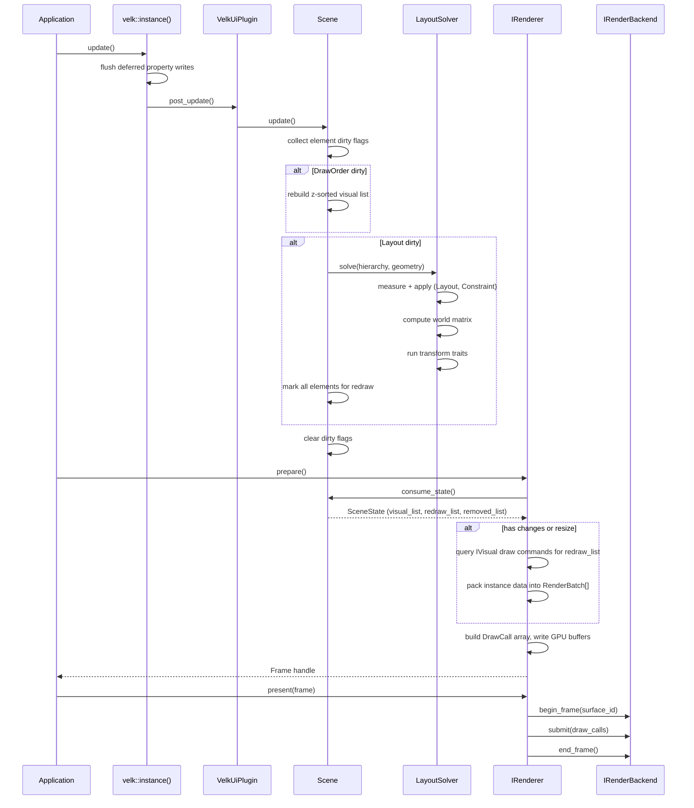

# Update cycle

This document is the **internal reference** for what happens inside `velk::instance().update()` when the scene tick runs: dirty flag accumulation, the layout solver, trait phases, and how the renderer pulls scene state during `prepare()`. For the user-level frame loop (poll/update/present), see [runtime.md](../runtime/runtime.md).

## Contents
- [Trait phases](#trait-phases)
  - [Solver pipeline (per element, top-down)](#solver-pipeline-per-element-top-down)
- [What happens during a frame](#what-happens-during-a-frame)
- [Dirty flags](#dirty-flags)
- [Scene update steps](#scene-update-steps)
- [Renderer steps](#renderer-steps)
  - [prepare()](#prepare)
  - [present(frame)](#presentframe)
- [Selective and multi-rate rendering](#selective-and-multi-rate-rendering)
- [Scene geometry](#scene-geometry)
- [Deferred updates](#deferred-updates)


## Trait phases

Every trait attached to an element belongs to one of following phases. See [Traits](traits.md) for the full guide on each category.

| Phase | Interface | Runs during | Purpose |
|-------|-----------|-------------|---------|
| **Input** | `IInputTrait` | Input dispatch | Handles pointer, scroll, key events. E.g. Click, Hover, Drag |
| **Layout** | `ILayoutTrait` | Scene update | Walks children, divides space. E.g. Stack |
| **Constraint** | `ILayoutTrait` | Scene update | Refines own size. E.g. FixedSize |
| **Transform** | `ITransformTrait` | Scene update | Modifies the world matrix. E.g. Trs, Matrix |
| **Visual** | `IVisual` | Renderer | Produces draw commands. E.g. RectVisual, TextVisual |
| **Input** | `IInputTrait` | Scene update | Input handling. Does not participate in the layout solver |
| **Render** | `none` | Renderer | Render observation. Defines a view into the scene. E.g. Camera |

Input runs synchronously when the platform delivers events (typically via the runtime's window dispatcher — see [Input](input.md)). Layout, Constraint, and Transform run inside `Scene::update()` via the layout solver. Visual runs inside `renderer->prepare()` when the renderer queries each element's visuals for draw commands.

### Solver pipeline (per element, top-down)

For each element in the hierarchy, the solver runs:

1. **Measure** (Layout + Constraint traits, sorted by phase): each `ILayoutTrait` refines the available bounds. Layout traits may query children. Constraint traits clamp or adjust size.
2. **Write size**: the solver writes the measured size into the element's state.
3. **Apply** (Layout + Constraint traits, same order): each trait writes final position/size. Layout traits position children.
4. **Compute world matrix**: `parent_world * translate(position)`.
5. **Transform** (all `ITransformTrait` attachments): each modifies the world matrix in place (rotation, scale, skew).
6. **Recurse** into children with the updated world matrix.

## What happens during a frame



The velk-ui plugin hooks into velk's update cycle via `post_update()`. For each live scene, it calls `Scene::update()`, which processes dirty flags accumulated since the last frame.

The renderer is passive and pull-based. It calls `scene->consume_state()` during `prepare()` to get the current visual list and any changes since the last frame.

## Dirty flags

Changes are tracked with `DirtyFlags`:

| Flag | Trigger | Effect |
|------|---------|--------|
| `Layout` | Element position/size changed, scene geometry changed | Re-runs the layout solver, marks all elements for redraw |
| `Visual` | Visual property changed (color, text, paint, etc.) | Element added to redraw list |
| `DrawOrder` | Element z-index changed, hierarchy modified | Rebuilds the z-sorted visual list |

Flags accumulate between frames. A single `update()` processes all pending changes at once.

## Scene update steps

1. **Collect element dirty flags**: each element that was notified of a property change has its flags consumed and merged into the scene's dirty flags. Elements with visual changes are added to the redraw list.
2. **Rebuild draw list** (if `DrawOrder` is set): elements are collected in z-sorted order.
3. **Layout solve** (if `Layout` is set): the solver walks the hierarchy top-down. For each element it runs the trait phases (Layout, Constraint, Transform) as described above. All elements are marked for redraw since transforms may have changed.
4. **Clear flags**: all dirty flags are reset for the next frame.

## Renderer steps

### prepare()

1. **Check surface resize**: if the surface dimensions changed, update the backend and mark batches dirty.
2. **Consume scene state**: pull `SceneState` from each attached scene.
3. **Process removals**: evict cached draw commands for removed elements.
4. **Rebuild draw commands**: for each element in the redraw list, query `IVisual` attachments for draw commands, resolve materials to pipeline keys.
5. **Rebuild batches** (if dirty): pack instance data into `RenderBatch` structs grouped by pipeline/format/texture.
6. **Write GPU buffers**: write instance data, draw headers, and material params into the staging buffer. Build the `DrawCall` array.

On clean frames (nothing changed), steps 3-5 are skipped and the renderer re-submits cached batches.

### present(frame)

1. **begin_frame**: acquire the swapchain image for each surface.
2. **submit**: record draw calls into the command buffer.
3. **end_frame**: submit GPU work and present.

Older unpresented frames targeting the same surfaces are silently discarded.

## Selective and multi-rate rendering

The `prepare()` method accepts a `FrameDesc` that controls which surfaces and cameras to render:

```cpp
// Render everything (default)
auto frame = renderer->prepare();

// Render only one surface
auto frame = renderer->prepare({{surface_a}});

// Render specific cameras on a surface
auto frame = renderer->prepare({{surface_a, {cam1, cam2}}});

// Render two surfaces
auto frame = renderer->prepare({{surface_a}, {surface_b}});
```

This enables multi-rate rendering where different surfaces update at different frequencies. Each surface's frames are independently sequential:

```cpp
if (time_for_60hz) {
    // Both surfaces update: one prepare, one present
    auto f = renderer->prepare({{main_surface}, {secondary_surface}});
    renderer->present(f);
} else {
    // Only the main display updates this tick
    auto f = renderer->prepare({{main_surface}});
    renderer->present(f);
}
```

## Scene geometry

Layout bounds are set explicitly on the scene, decoupled from any renderer or surface:

```cpp
scene.set_geometry(velk::aabb::from_size({800.f, 600.f}));
```

When using the runtime, `app.add_view(window, camera)` sets the scene geometry from the window size and listens for `on_resize` to keep them synchronized — you don't have to do this yourself. If you're driving rendering manually (no runtime), update both the scene geometry and the ISurface dimensions when the window resizes; the renderer detects the surface dimension change during `prepare()` and rebuilds batches, and the scene re-solves layout on the next `update()`.

## Deferred updates

Property changes can be deferred via velk's `Deferred` flag. Deferred writes are batched and applied during `velk::instance().update()`, before the scene processes them. This is useful for bulk property changes that should trigger only one layout pass.
