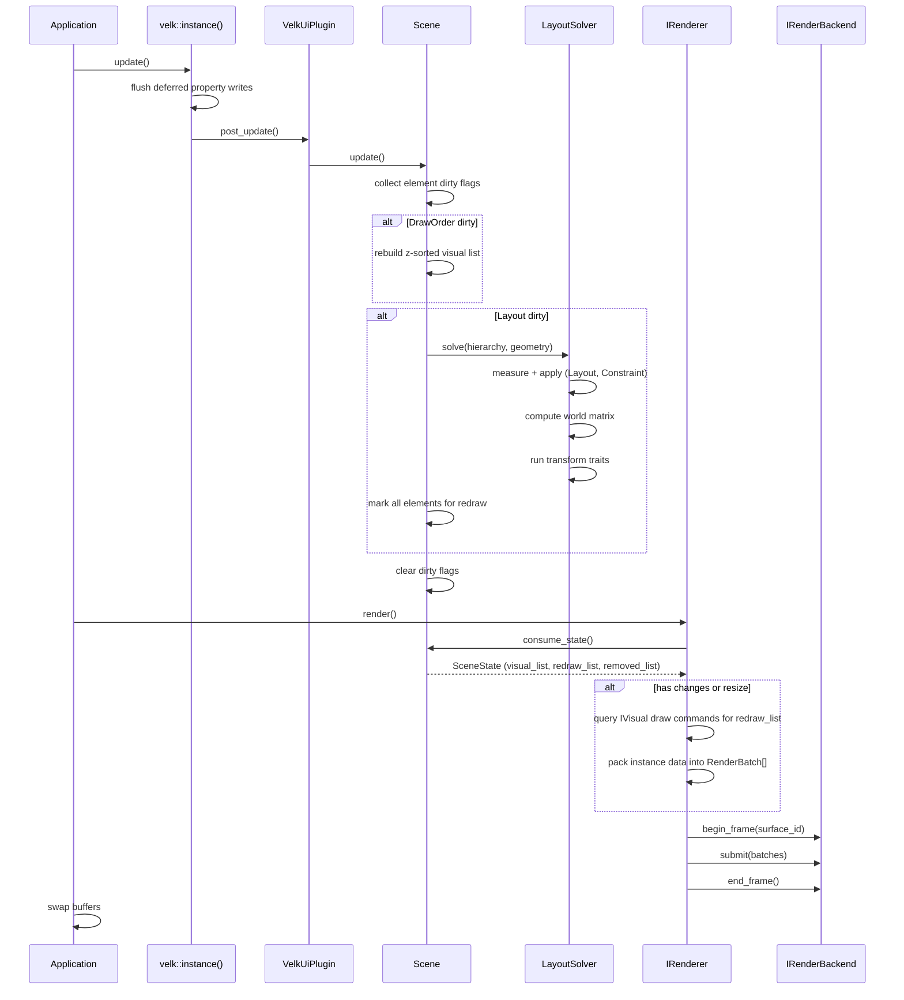

# Update cycle

velk-ui's frame loop is driven by `velk::instance().update()`, which triggers the scene's layout solver, followed by `renderer->render()` which pulls changes and draws.

## Frame loop

```cpp
while (running) {
    glfwPollEvents();
    velk::instance().update();  // drives scene update via plugin post_update
    renderer->render();         // pulls scene state, batches, draws
    glfwSwapBuffers(window);
}
```

## Trait phases

Every trait attached to an element belongs to one of five phases. See [Traits](traits.md) for the full guide on each category.

| Phase | Interface | Runs during | Purpose |
|-------|-----------|-------------|---------|
| **Input** | `IInputTrait` | Input dispatch | Handles pointer, scroll, key events. E.g. Click, Hover, Drag |
| **Layout** | `ILayoutTrait` | Scene update | Walks children, divides space. E.g. Stack |
| **Constraint** | `ILayoutTrait` | Scene update | Refines own size. E.g. FixedSize |
| **Transform** | `ITransformTrait` | Scene update | Modifies the world matrix. E.g. Trs, Matrix |
| **Visual** | `IVisual` | Renderer | Produces draw commands. E.g. RectVisual, TextVisual |

Input runs synchronously in GLFW callbacks before `update()` (see [Input](input.md)). Layout, Constraint, and Transform run inside `Scene::update()` via the layout solver. Visual runs inside `renderer->render()` when the renderer queries each element's visuals for draw commands.

### Solver pipeline (per element, top-down)

For each element in the hierarchy, the solver runs:

1. **Measure** (Layout + Constraint traits, sorted by phase): each `ILayoutTrait` refines the available bounds. Layout traits may query children. Constraint traits clamp or adjust size.
2. **Write size**: the solver writes the measured size into the element's state.
3. **Apply** (Layout + Constraint traits, same order): each trait writes final position/size. Layout traits position children.
4. **Compute world matrix**: `parent_world * translate(position)`.
5. **Transform** (all `ITransformTrait` attachments): each modifies the world matrix in place (rotation, scale, skew).
6. **Recurse** into children with the updated world matrix.

## What happens during a frame



The velk-ui plugin hooks into velk's update cycle via `post_update()`. For each live scene, it calls `Scene::update()`, which processes dirty flags accumulated since the last frame.

The renderer is passive and pull-based. It calls `scene->consume_state()` during `render()` to get the current visual list and any changes since the last frame.

## Dirty flags

Changes are tracked with `DirtyFlags`:

| Flag | Trigger | Effect |
|------|---------|--------|
| `Layout` | Element position/size changed, scene geometry changed | Re-runs the layout solver, marks all elements for redraw |
| `Visual` | Visual property changed (color, text, paint, etc.) | Element added to redraw list |
| `DrawOrder` | Element z-index changed, hierarchy modified | Rebuilds the z-sorted visual list |

Flags accumulate between frames. A single `update()` processes all pending changes at once.

## Scene update steps

1. **Collect element dirty flags**: each element that was notified of a property change has its flags consumed and merged into the scene's dirty flags. Elements with visual changes are added to the redraw list.
2. **Rebuild draw list** (if `DrawOrder` is set): elements are collected in z-sorted order.
3. **Layout solve** (if `Layout` is set): the solver walks the hierarchy top-down. For each element it runs the trait phases (Layout, Constraint, Transform) as described above. All elements are marked for redraw since transforms may have changed.
4. **Clear flags**: all dirty flags are reset for the next frame.

## Renderer steps (during render())

1. **Check surface resize**: if the surface dimensions changed, update the backend and mark batches dirty.
2. **Consume scene state**: pull `SceneState` from each attached scene.
3. **Process removals**: evict cached draw commands for removed elements.
4. **Rebuild draw commands**: for each element in the redraw list, query `IVisual` attachments for draw commands, resolve materials to pipeline keys.
5. **Rebuild batches** (if dirty): pack instance data into `RenderBatch` structs grouped by pipeline/format/texture.
6. **Submit to backend**: `begin_frame`, `submit(batches)`, `end_frame`.

On clean frames (nothing changed), steps 3-5 are skipped and the renderer re-submits cached batches.

## Scene geometry

Layout bounds are set explicitly on the scene, decoupled from any renderer or surface:

```cpp
scene.set_geometry(velk::aabb::from_size({800.f, 600.f}));
```

To handle window resize, update both the scene geometry and the surface dimensions:

```cpp
static void on_resize(GLFWwindow* window, int width, int height)
{
    scene->set_geometry(velk::aabb::from_size({
        static_cast<float>(width), static_cast<float>(height)}));
    velk::write_state<velk_ui::ISurface>(surface, [&](velk_ui::ISurface::State& s) {
        s.width = width;
        s.height = height;
    });
}
```

The scene will re-solve layout on the next `update()`. The renderer detects the surface dimension change during `render()` and rebuilds batches.

## Deferred updates

Property changes can be deferred via velk's `Deferred` flag. Deferred writes are batched and applied during `velk::instance().update()`, before the scene processes them. This is useful for bulk property changes that should trigger only one layout pass.
