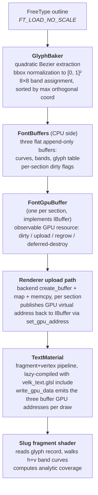

# Text plugin

The text plugin (`velk_text`) renders text using **analytic Bezier glyph coverage**, adapted from Eric Lengyel's public-domain [Slug](https://github.com/EricLengyel/Slug) reference shaders. There is no glyph atlas. Glyph outlines are extracted once with FreeType, packed into GPU-resident curve and band buffers, and shaded per-pixel by a fragment shader that computes exact analytic coverage of every Bezier inside the sample's footprint.

## Contents

- [Why this matters](#why-this-matters)
- [Usage](#usage)
- [Drawing text](#drawing-text)
  - [TextVisual](#textvisual)
  - [Font size](#font-size)
- [How it works](#how-it-works)
  - [Pipeline](#pipeline)
  - [GPU data layout](#gpu-data-layout)
  - [Coordinate convention](#coordinate-convention)
- [JSON declaration](#json-declaration)
- [Validation tool](#validation-tool)
- [Open items](#open-items)
- [Reference](#reference)
  - [IFont](#ifont)
  - [ITextVisual](#itextvisual)
  - [ITextPlugin](#itextplugin)


## Why this matters

The standard way to render text on a GPU is to rasterize each glyph at a target size into an atlas texture and sample it at draw time. That gives sharp text at the bake size and progressively worse text everywhere else: zoom in and you see filtered pixels, zoom out and you see aliasing or need mipmaps. Atlases also tie the font to a specific pixel size: the same font at three different sizes is three different bakes.

Analytic Bezier coverage avoids all of this. The shader knows the exact mathematical outline of every glyph at any zoom level. There is no bake resolution to choose, no mip selection, no atlas packing, no resampling, and no LOD logic. The same font instance can render at any pixel size without re-baking, with sub-pixel anti-aliasing computed from the curve geometry directly.

The trade-off is shader cost: every text pixel runs an inside-test that walks a small list of Bezier curves and computes a polynomial root. The band acceleration structure keeps that list short (typically 6 to 16 curves per pixel for typical Latin glyphs), so cost stays bounded and predictable. For UI text quantities the total cost is well within budget.

The same coverage function is callable from both fragment shaders (for the rasterization path) and any-hit shaders (for ray-traced rendering), so the analytic representation also serves the future RT direction without a parallel codepath.

## Usage

Load the plugin like any other:

```cpp
velk::instance().plugin_registry().load_plugin_from_path("velk_text.dll");
```

The plugin's `initialize()` registers `Font`, `FontGpuBuffer`, `TextMaterial`, and `TextVisual`, and creates a shared default font (embedded Inter Regular) accessible via `ITextPlugin::default_font()`.

## Drawing text

### TextVisual

Attach a `TextVisual` to any element. By default the visual uses the shared default font.

```cpp
#include <velk-ui/api/element.h>
#include <velk-ui/plugins/text/api/text_visual.h>

using namespace velk::ui;

auto element = create_element();
auto text    = visual::create_text();

text.set_text("Hello, Velk");
text.set_font_size(24.f);
text.set_color(color::white());

element.add_trait(text);
```

The visual shapes the text with HarfBuzz on every change to `text` or `font_size`, lazy-bakes any glyphs it hasn't seen before, and emits one quad per laid-out glyph. All quads in one text element share a single draw call.

### Font size

`font_size` is a property of the visual, not the font. The font is **fully scale-independent**: glyph outlines are baked once with `FT_LOAD_NO_SCALE` and normalized to `[0, 1]^2` per glyph; HarfBuzz is configured at init so shaping advances come back in font units; metrics are exposed in font units. The visual computes `scale = font_size / units_per_em` and applies it to advances, glyph offsets, bbox extents, ascender, and line height when emitting per-glyph quads.

Practical consequences:

  * The same `Font` instance can serve any pixel size with no re-baking and no extra memory.
  * Many `TextVisual`s sharing one font can each draw at a different size simultaneously.
  * Changing `font_size` at runtime triggers a reshape but does not touch the font's GPU buffers.
  * Quality stays exact at any size (the shader walks the actual curve geometry, not a sampled approximation).

## How it works

### Pipeline



Glyph baking is **lazy and append-only**: The first time a glyph_id is referenced, the font
  * extracts its outline
  * packs the curves and bands and 
  * appends the data to the GPU buffers.

Subsequent references return the cached entry.

### GPU data layout

  * **Curve buffer**: array of `QuadCurve { vec2 p0, p1, p2 }`, 24 bytes each. Curves are normalized to `[0, 1]^2` over each glyph's bbox so the shader's uv (also in `[0, 1]`) can be used directly.
  * **Band buffer**: flat `uint32_t[]`. Per glyph, the layout starting at `band_data_offset` is:

        h_offsets[N+1]   prefix sums into the h curve index list
        h curve indices  uint32_t each, glyph-relative
        v_offsets[N+1]
        v curve indices

    where `N = BakedGlyph::BAND_COUNT = 8`. Curves within each band are sorted descending by their max coordinate on the orthogonal axis, so the shader can early-exit once a curve falls outside the sample's footprint.
  * **Glyph table**: array of `GlyphRecord` (32 bytes), one per baked glyph. Holds bbox in font units, curve_offset, curve_count, band_data_offset.
  * **Per-instance**: `TextInstance` (48 bytes, padded for std430 array stride) carries pos, size, color, glyph_index.
  * **Per-batch material data**: three `uint64_t` GPU addresses for the curves, bands, and glyph table buffers, written into the staging buffer right after the `DrawDataHeader`. The shader binds them via `buffer_reference` and walks them in `velk_text_coverage`.

For printable ASCII rendered with Inter, the entire per-font upload is about 92 KB (48 KB curves, 41 KB bands, 3 KB glyph table). This scales linearly with the number of unique glyphs actually used.

### Coordinate convention

The baker normalizes curves to `[0, 1]^2` over the bbox in **FreeType's Y-up convention** (descender at y = 0, ascender at y = 1). The vertex shader flips quad uv to match: `v_uv = vec2(q.x, 1.0 - q.y)`. The fragment shader and `velk_text_coverage` operate in this Y-up glyph normalized space.

## JSON declaration

A `TextVisual` trait can be added as an attachment to one or more `Element` to render text:

```json
{
  "targets": ["card_title"],
  "class": "velk_text.TextVisual",
  "properties": {
    "text": "Total Users",
    "font_size": 32.0,
    "h_align": "left",
    "v_align": "center",
    "color": { "r": 0.85, "g": 0.85, "b": 0.9, "a": 1.0 }
  }
}
```

`text`, `font_size`, `h_align`, and `v_align` are all standard properties. `color` lives on the base `IVisual` interface.

The default font is created automatically by the plugin and used unless the visual's `set_font` method is called explicitly with a different font. There is no need to declare the font in the scene file.

## Validation tool

`glyph_dump` is a separate executable target in `plugins/text/CMakeLists.txt`. It bakes the printable ASCII range from the embedded Inter font and prints per-glyph and per-band statistics. Useful when changing the baker, validating a new font, or revisiting the band count tuning question.

```
./bin/Release/glyph_dump.exe
```

The tool also exercises `FontBuffers` end-to-end (bake, upload-size report, idempotent re-bake check) so it doubles as a regression smoke test for the CPU side of the pipeline.

## Future improvements

  * Only TTF is supported currently, to be added: CFF / OTF (cubic outlines)
  * Even-odd fill rule (Lengyel's `SLUG_EVENODD`)
  * Optical weight boost (Lengyel's `SLUG_WEIGHT`)
  * Subpixel hinting / LCD AA
  * CJK / very large glyph sets
  * Multi-font batching
  * Any-hit shader path for ray tracing

## Reference

### IFont

Defined in `velk-ui/include/velk-ui/interface/intf_font.h`.

```cpp
class IFont : public Interface<IFont>
{
public:
    struct GlyphPosition  // in font units (visual scales to pixels)
    {
        uint32_t glyph_id;
        vec2 offset;
        vec2 advance;
    };

    struct GlyphInfo
    {
        uint32_t internal_index;  // index into the GPU glyph table
        vec2 bbox_min;            // font units
        vec2 bbox_max;
        bool empty;               // true for whitespace etc
    };

    VELK_INTERFACE(
        (RPROP, float, ascender,     0.f),  // font units
        (RPROP, float, descender,    0.f),  // font units
        (RPROP, float, line_height,  0.f),  // font units
        (RPROP, float, units_per_em, 0.f)
    )

    virtual bool init_default() = 0;
    virtual float shape_text(string_view text, vector<GlyphPosition>& out) = 0;
    virtual GlyphInfo ensure_glyph(uint32_t glyph_id) = 0;

    virtual IBuffer::Ptr get_curve_buffer() const = 0;
    virtual IBuffer::Ptr get_band_buffer()  const = 0;
    virtual IBuffer::Ptr get_glyph_buffer() const = 0;
};
```

Notably absent: `set_size`, `size_px`, `get_pixels`, `get_atlas_*`. The font has no notion of pixel size and no glyph atlas. Pixel size is a property of the consuming visual.

### ITextVisual

Defined in `velk-ui/plugins/text/include/velk-ui/plugins/text/intf_text_visual.h`.

```cpp
class ITextVisual : public Interface<ITextVisual>
{
public:
    VELK_INTERFACE(
        (PROP, string,     text,      {}),
        (PROP, float,      font_size, 16.f),
        (PROP, ui::HAlign, h_align,   ui::HAlign::Left),
        (PROP, ui::VAlign, v_align,   ui::VAlign::Top)
    )

    virtual void set_font(const IFont::Ptr& font) = 0;
};
```

`color` is inherited from `IVisual`. The visual uses the shared default font unless `set_font` is called explicitly.

### ITextPlugin

Defined in `velk-ui/plugins/text/include/velk-ui/plugins/text/intf_text_plugin.h`.

```cpp
class ITextPlugin : public Interface<ITextPlugin>
{
public:
    virtual IFont::Ptr default_font() const = 0;
};
```

Access via the plugin registry:

```cpp
auto plugin = velk::get_or_load_plugin<ITextPlugin>(PluginId::TextPlugin);
auto font   = plugin ? plugin->default_font() : nullptr;
```
